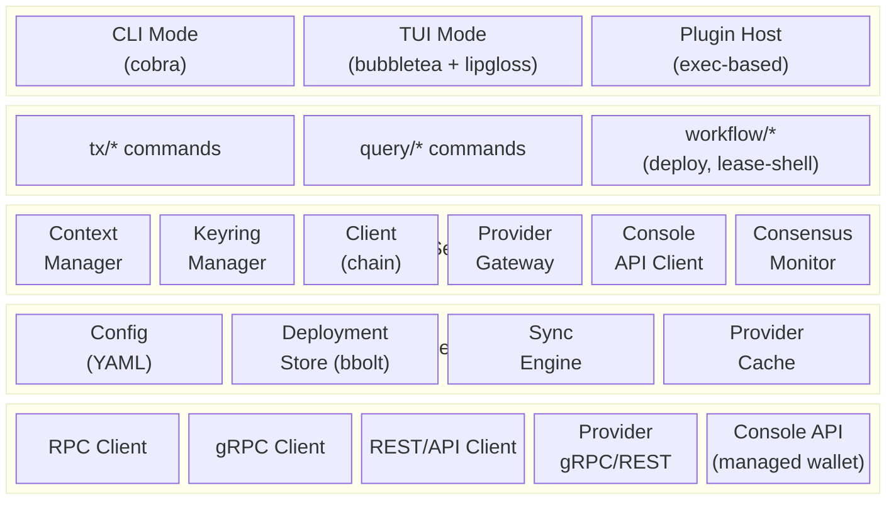
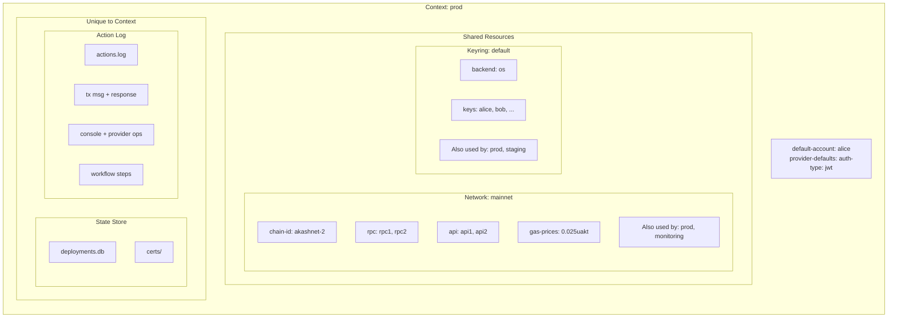
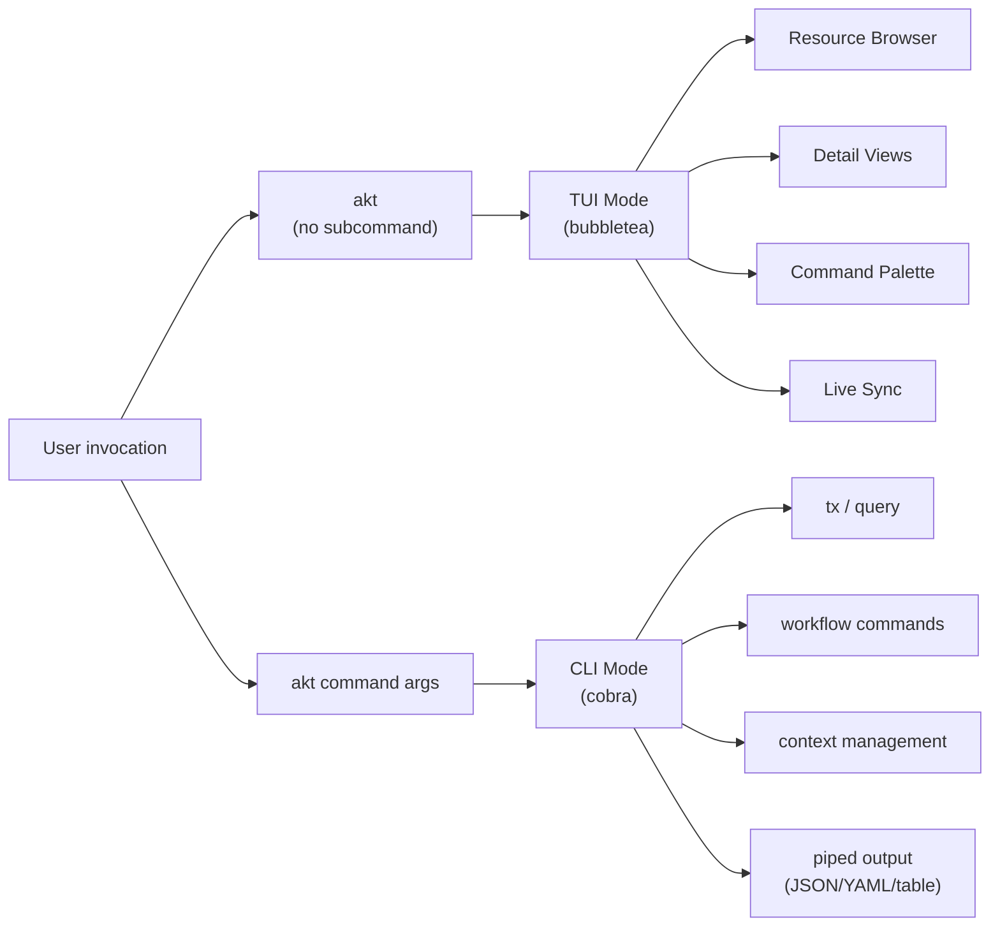
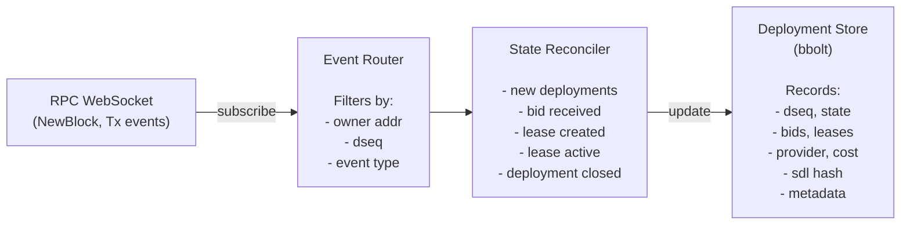
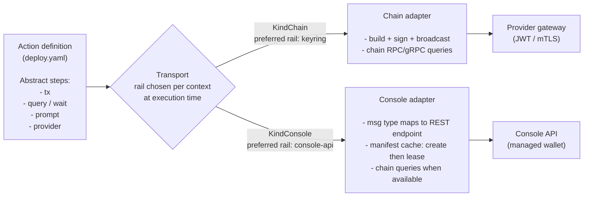
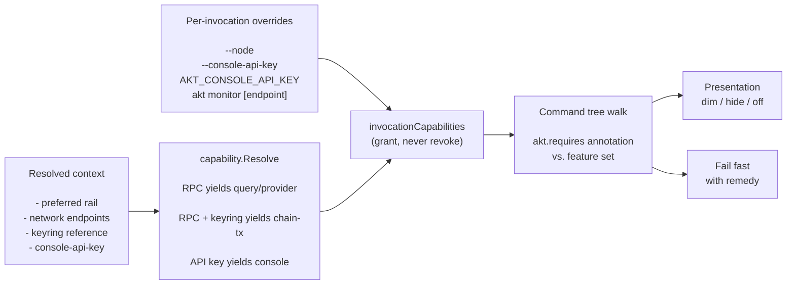

# Akash CLI (`akt`) - Architecture Design

## 1. Overview

`akt` is the unified command-line interface and terminal user interface for the Akash Network. It replaces the CLI functionality currently spread across `akash-network/node`, `akash-network/provider`, and `akash-network/chain-sdk/go/cli` with a single, cohesive tool that supports both traditional CLI commands and an interactive TUI.

### 1.1 Goals

- **Unified entry point**: One binary (`akt`) for all Akash user interactions -- deployments, leases, provider queries, certificate management, governance, staking, and more.
- **Switchable contexts**: named contexts allowing users to work across multiple networks, accounts, and environments seamlessly.
- **Dual-mode interface**: Traditional CLI for scripting and automation, plus an interactive TUI for real-time monitoring and management.
- **Real-time network monitoring**: Live consensus state visualization, validator voting status, and provider fleet health monitoring -- incorporating the functionality of [`aktop`](https://github.com/cloud-j-luna/aktop) directly into the TUI.
- **Local state tracking**: A local store that tracks deployment lifecycle, syncs with chain state, and supports backup/restore.
- **Console API integration**: Contexts can authenticate via [Akash Console](https://console.akash.network) API key, using the Console's custodial managed wallet for deployment operations without local key management.
- **Plugin extensibility**: A plugin system for community-contributed commands and integrations.
- **Flag-minimal operation**: After initial context configuration (network, keyring, default account), the majority of CLI operations require zero additional flags or environment variables. The context system supplies all defaults — users type only the command and, when needed, a resource identifier. Flags remain available as overrides but are not the primary interaction model.
- **Argument-driven filtering**: Query commands use positional arguments for resource identification instead of flag-based filters. Akash resources follow a hierarchical identity model; the filter argument accepts a `/`-separated path with smart type detection (bech32 address = owner/provider, number = dseq). An omitted leading owner defaults to the context's default account. Non-identity filters like `--state` remain as flags. For bids and leases, `--by provider` switches the filter hierarchy so the leading address is the provider (`provider/dseq/gseq/oseq/owner`) instead of the owner.

### 1.2 Non-Goals

- Running an Akash provider node (the `run` command and Kubernetes operators remain in `akash-network/provider`).
- Running a blockchain validator node (the `start` command and server infrastructure remain in `akash-network/node`).
- Genesis preparation, chain initialization, and testnet scaffolding commands.

### 1.3 Relationship to Existing Repositories

| Repository                       | Current Role                                                                                             | After `akt`                                                                                                                                                 |
|----------------------------------|----------------------------------------------------------------------------------------------------------|-------------------------------------------------------------------------------------------------------------------------------------------------------------|
| `akash-network/chain-sdk/go/cli` | All CLI command definitions (tx, query, keys, server)                                                    | **Deprecated.** Commands clean-copied into `akt`. Package removed once `akt` reaches parity.                                                                |
| `akash-network/node`             | Blockchain node binary (`akash`). Imports chain-sdk CLI, adds server/genesis/testnet commands.           | **Keeps** only node-operator commands: `start`, `comet`, `export`, `prepare-genesis`, `testnet`, `testnetify`, `auth jwt`. Stops exporting user-facing CLI. |
| `akash-network/provider`         | Provider binary (`provider-services`). Imports chain-sdk CLI, adds provider gateway + operator commands. | **Keeps** only provider-operator commands: `run`, `operator *`, `tools *`, `migrate`. Stops exporting user-facing CLI.                                      |
| `ovrclk/akt` (pre-rewrite)       | MVP CLI prototype. Config system, account/network/deploy commands.                                       | Design reference. Concepts (profiles, git-like config) evolved into the context system. Replaced in place by the rewrite below.                             |
| `cloud-j-luna/aktop`             | Community TUI for monitoring Akash consensus state, validator voting, and provider operations.           | Design reference and prior art for TUI. Its consensus/validator/provider monitoring views inform the TUI design. Functionality subsumed by `akt monitor`. |
| **`akash-network/akt`**          | **New.** This repository, and the rewrite that replaced the prototype above.                             | The unified user CLI. Transferred from `ovrclk/akt`, which now redirects here; releases and the Homebrew cask publish under this name.                       |

### 1.4 The `monitor` Command

`akt monitor` is a hub-based real-time monitoring tool. It is one of the most important tools in the Akash ecosystem for observing network health, provider fleet status, and BME state — especially during coordinated chain upgrades.

The hub presents three dashboards, navigable via Tab/Shift-Tab:

| Dashboard | CLI Subcommand | Content |
|-----------|---------------|---------|
| **Network** (default) | `akt monitor network` | Consensus state, validator voting, governance proposals, governance parameters |
| **Provider** | `akt monitor provider` | Provider fleet health, version distribution, resource utilization |
| **Oracle/BME** | `akt monitor oracle` / `akt monitor bme` | Aggregated prices, price health, vault state, mint status, ledger |

`akt monitor` with no subcommand launches the hub, defaulting to the Network dashboard. Each subcommand launches directly into its respective dashboard. `akt monitor oracle` and `akt monitor bme` are aliases that both open the Oracle/BME dashboard.

#### Goals

- **Real-time network state monitoring**: Live consensus state (height, round, step), validator voting progress (prevote/precommit power), and individual validator vote status — updated via WebSocket subscription to the RPC endpoint.
- **Provider fleet monitoring**: Real-time provider health scanning, version distribution visualization, per-provider resource utilization (CPU, memory, GPU), and node-level detail. Smart caching with priority-based scheduling (online: 1m, recently offline: 5m, long-term offline: 6h).
- **Oracle and BME state monitoring**: Live aggregated prices with TWAP, median, min/max, source count, and price health status. BME vault state (balances, total burned/minted, remint credits), mint status (healthy/warning/halt with collateral ratio and thresholds), and recent ledger entries. Combined into a single dashboard since BME depends on oracle prices.
- **Governance visibility**: Active proposals with vote tallies, and module-by-module governance parameter browsing.
- **Critical tool during network upgrades**: Validators coordinate upgrades at a specific block height; the chain halts while validators upgrade their software. Online block explorers and status pages frequently lag, stall, or lose their WebSocket connections during these windows, making them unreliable. `akt monitor` connects directly to the user's chosen RPC endpoint, providing the authoritative local view of: which round and step the chain is in, which validators have come back online and are voting, whether 2/3+ voting power has reached precommit, and when the chain resumes block production.
- **Standalone operation**: Requires only an RPC endpoint — no keyring, no default account, no chain-id. A monitoring-only context (with no `default-account`) or a bare `--rpc` flag is sufficient. This makes it usable by anyone observing the network, not just deployers.
- **Context-integrated but not context-dependent**: When a context is active, the RPC endpoint resolves automatically (consistent with the flag-minimal operation goal). A positional argument or `--rpc` flag overrides for ad-hoc monitoring of any network.
- **Hub-based navigation**: Tab/Shift-Tab cycles between three dashboards (Network, Provider, Oracle/BME); number keys (1/2/3/4) switch sub-tabs within the Network dashboard. Each dashboard is also directly accessible via its CLI subcommand.

The monitor owns those navigation keys while it is visible. Standalone
`akt monitor` sends input directly to the monitor model and renders that
model's full-height view, including its own navigation help and RPC status.
The hidden resource router is not part of the standalone input path. In the
experimental embedded shell, monitor-local Tab/Shift-Tab and Network 1/2/3/4
take precedence over shell navigation; Esc returns ownership to the shell.
This keeps the same visible controls functional in both launch modes while
preserving the shell's global shortcuts outside the monitor.

An explicit monitor RPC also makes configuration optional: it does not launch
the first-run bootstrap or require a keyring merely because no akt config file
exists. Cache creation/open failures are startup errors rather than a silent
empty dashboard, and `--clean-cache` removes both the current and legacy cache
filenames or reports why it could not.

Governance data follows the same typed query boundary as the CLI. The monitor
queries recent `cosmos.gov.v1` proposals through its selected RPC endpoint and
uses the live tally query for proposals still in the voting period. The
proposal list delegates to the same pretty renderer as `akt query gov
proposals`; completed proposals show their final tallies and active proposals
show the current tally. A separate Parameters sub-tab queries the complete
`cosmos.gov.v1` parameter response, converts that protobuf with Cosmos JSON
semantics, and delegates rendering to the shared pretty parameter renderer. It
does not compose a modern view from a single legacy REST subtype, because
absent deposit and tally fields would otherwise render as valid-looking zero
values.

Governance query inputs are resolved at the CLI boundary. Proposal identifiers,
voter and depositor addresses, pagination, and the
`voting|tallying|deposit` parameter selector are validated before the
governance query client is invoked. Queries that first confirm a proposal
exists retain the dependency error as a wrapped cause so callers can classify
the failure with `errors.Is`.

Consensus input is external data and is validated before it reaches the view
model. Height, round, and numeric step values cannot be negative. A malformed
round must return an error rather than becoming an index into a vote set. Vote
state belongs to one height and round: either value changing replaces the
prevote and precommit state, including a new round at the same height. The
monitor never carries votes from an earlier round into the current one. Because
WebSocket delivery can be delayed or reordered, an event behind the current
height, round, or step is ignored; it can never rewind the displayed state.
Conversely, a valid vote at a higher height, or at a higher round in the same
height, is sufficient evidence of forward consensus progress. The tracker
advances to that vote's height and round and clears the prior vote set even if
a reconnect prevented the corresponding `NewRoundStep` event from arriving.
The CometBFT client may reconnect its transport without restoring server-side
subscriptions. A successful transport reconnect is therefore not considered a
restored consensus feed until both `Vote` and `NewRoundStep` subscriptions have
been reissued and the server has acknowledged both with valid JSON-RPC
subscribe responses. Events that race ahead of the acknowledgements are
buffered rather than discarded. If either subscription cannot be restored, the
client is stopped and the consumer channel closes instead of leaving the
dashboard attached to a silent connection. Both the transport reconnect delay
and the view model's bounded retry delay are owned by the monitor and terminate
immediately on context cancellation.
Validator identity and voting power are height-scoped, not session-scoped.
The consensus tracker refreshes the validator set before applying the first
event of a higher height and never caches a failed validator response. It does
not calculate a new height with stale indices or power. An initial WebSocket or
validator fetch failure is displayed and schedules another bounded connection
attempt; a transient startup outage cannot permanently stop consensus until
the user restarts `akt monitor`. The initial signing-history sample uses the
validator set from the sampled commit height, not the latest set, so an epoch
change cannot attribute the previous block's signature to a new validator.

Upgrade behavior is proved against a throwaway three-validator chain, not only
mock events. The validators hold 60%, 25%, and 15% of voting power and halt at
one height. Restarting only the RPC validator gives the monitor a live endpoint
and 60% participation but cannot produce the next block. Restarting the 25%
validator crosses the two-thirds threshold and resumes the chain. The monitor
must reconnect, retain the complete denominator, clear halted-round votes at
the new height, and continue monotonically when the final validator rejoins.

Provider monitoring is a continuously running pipeline, not a view that is
populated only after navigation. Startup loads the persisted provider cache,
immediately reconciles it with the on-chain provider set, and starts the health
check, chain-resync, and cache-save schedules. Switching dashboards changes only
what is rendered; it does not start or stop the pipeline. Manual refresh
requests an immediate reconciliation while retaining the periodic schedules.
Provider records and validator monikers share the monitor's bbolt database at
`cache/monitor.db`; no JSON cache migration path is exposed.
The selected version is a real table filter, not only a sort preference. Every
reconciliation rebinds the selection to the rebuilt version list so an
appearing or disappearing version cannot leave an invalid index. Provider
detail responses carry the requested provider identity and are discarded when
the user has since selected another provider or left the detail view.
Both REST and gRPC provider probes verify TLS certificates by default. The
diagnostic `--insecure` override is threaded through both transports; neither
probe may silently opt out on its own.

Monitor examples use an RPC endpoint that is verified to expose CometBFT's
WebSocket service. HTTP-only public gateways are still valid for ordinary chain
queries, but they must not be advertised for a command whose primary data path
is a WebSocket subscription. The same rule applies to built-in network
templates: their first RPC is the flagless monitor endpoint and is therefore
WebSocket-capable. Monitor auxiliary REST reads use the selected context's API
endpoint only when the selected RPC belongs to that context. An ad-hoc RPC
override derives a same-origin REST endpoint (or uses explicit `--rest`) rather
than silently combining one network's RPC with another network's API. Known
HTTP-only primaries from older built-in templates are replaced at monitor
resolution by the current template's WebSocket endpoint without rewriting the
user's context; an explicit endpoint is never substituted. The cache stays
below the resolved CLI home so `--home` remains a complete isolation boundary.

The standalone monitor receives the entire terminal height. The embedded
monitor receives exactly the shell content height after all shell chrome is
reserved; its renderer and input model use the same dimensions so navigation
help and bottom rows are not clipped. The standalone model owns an alternate
screen for its complete lifetime so a monitor session cannot paint or scroll
through the caller's normal terminal buffer; an embedded model leaves that
choice to the containing shell. The runtime also owns one cancellable context
shared by every network command started by the model, including consensus
HTTP/WebSocket requests, provider probes, and governance, oracle, and BME
refreshes. It cancels that context before closing the event client, bus, and
database, and joins both command work and the longer-lived consensus producer;
leaving the Bubble Tea loop must not strand a network goroutine until process
exit. The experimental embedded shell applies the same cancel-and-drain
boundary to the monitor it hosts before closing shared event and cache
resources.

The shipped standalone runtime also fails startup when it cannot construct or
start its CometBFT event client, or when the local event service cannot enqueue
its `NewBlockHeader` subscription. Those branches share the normal idempotent
teardown path: cancel and drain model work, stop an event service and client
that started, close the event bus, and close the cache database. A monitor must
not open with a knowingly absent event producer and present an empty bus as a
healthy live feed.

This startup check does not yet prove that the CometBFT server accepted the
subscription. The pinned upstream client returns from `Subscribe` after it
queues the JSON-RPC request; it consumes a later server rejection inside a
private listener. A repository-owned `NewBlockHeader` transport that waits for
the matching server acknowledgement, preserves an event that races ahead of
that acknowledgement, and exposes terminal reconnect failure remains roadmap
work. Until then, the runtime guarantee covers local setup failures only and
must not be described as end-to-end subscription readiness.

#### Non-Goals

- **Deployment, lease, or user-specific resource monitoring**: `monitor` is a network-wide observation tool, not a deployment management interface.

---

## 2. High-Level Architecture



Two distinct things are called *transport* in this document, at different levels. The bottom block is the **wire transport**: the concrete clients (RPC, gRPC, REST, provider gateway, Console API) and their multi-endpoint failover (§5.6). The **transport translation layer** (`internal/transport`, §3.5) sits much higher, between the command layer and core services: it translates abstract workflow actions onto a *rail* — chain or console — and each rail then uses whichever wire transports it needs.

---

## 3. Core Design Concepts

### 3.1 Context System

The context system is the foundational concept of the new CLI. Every operation executes within a named context. A context is a composition of four distinct objects, some shared and some unique:



#### 3.1.1 Context Components

**Network** (shared, templatable):
- Defines chain connectivity: chain-id, RPC/API/gRPC endpoints, gas prices, gas adjustment.
- Can be shared by multiple contexts (e.g., a "mainnet" network used by both "prod" and "monitoring" contexts).
- Instantiatable from built-in templates (mainnet, testnet, sandbox).
- Built-in templates track the Akash network registry's current chain IDs and
  endpoints; the sandbox template targets the live `sandbox-2` network.
- After startup loads the common config, runtime code derives the mainnet chain
  ID from the configured `mainnet` network. Command code does not duplicate the
  registry-owned chain ID as a literal or package-level variable.
- The human context detail view presents these resolved fields in one
  `Network` subsection. It does not repeat the shared network object's name as
  a separate row above that subsection; structured output retains the complete
  network object, including its name.
- When a shared network's config is edited within a context, two modes are offered:
  - **Edit parent**: Modify the network definition. Change applies to all contexts using it.
  - **Fork**: Create a copy of the network for this context only. The context switches to the forked copy.

**Keyring** (shared):
- Wallet storage. Contains private keys, mnemonics, hardware wallet references.
- Can be shared between multiple contexts. Adding a key to a keyring makes it available to all contexts that reference it.
- Each context selects a default account from its keyring.
- Used by explicit local transactions and authenticated provider operations.
  A Console-preferred workflow does not open it unless that invocation reaches
  one of those local operations.

**State Store** (unique per context):
- Deployment, lease, and bid records (bbolt database).
- Certificate cache.
- Sync state metadata.

**Action Log** (unique per context):
- Append-only log of all mutating user actions within the context.
- Each entry records what was done, when, and the result.
- A transaction action consists of two parts: the tx message and the chain response.
- A sync broadcast is first recorded as pending. When the log is viewed, akt
  best-effort reconciles pending transaction hashes against the context's RPC
  endpoint and appends a terminal revision. Reads collapse revisions by hash,
  preserving append-only storage while presenting one current transaction row.
- Workflow steps, provider operations, context changes, Console API calls, and errors are also logged. Read-only queries are not recorded by default.
- Each serialized JSONL record is bounded by the 10 MiB rotation budget before
  it reaches disk. Readers enforce the identical ceiling and surface flush or
  rotated-generation I/O failures, so a hostile local file cannot force
  unbounded allocation and a damaged generation cannot masquerade as a
  complete audit history.

#### 3.1.2 Context Propagation

The context is resolved once at application startup and propagated through the entire session:

1. Resolve which context to use: `--context` flag > `AKT_CONTEXT` env var > `current-context` in config.
2. Load the context's network, keyring, store, and action log.
3. Apply overrides: flags > env vars > network config > built-in defaults.
4. Inject the resolved context into all services (client, provider gateway, sync engine, TUI).

Transaction subtrees imported from Cosmos SDK or IBC modules are not exempt
from this boundary. Before any transaction leaf constructs a message, queries
an account, simulates, or broadcasts, akt installs the selected context's
client context and discovered chain client on that leaf. Dependency defaults
such as `tcp://localhost:26657` must never replace a resolved endpoint. Local
transaction leaves use the same pre-run boundary; a leaf that needs codecs or
clients cannot reach its handler without that initialization.

Transaction economics come from the selected network definition, not an
individual RPC operator. The Akash network registry publishes low, average,
and high gas prices; akt stores the high price when first-run bootstrap adds a
network because a validator can enforce a higher CheckTx minimum than the RPC
node used for simulation advertises. Built-in network templates carry the same
policy. At root CLI initialization, a gas-price-derived transaction treats the
stored network price as its acceptance floor. Invocation and environment
prices can request higher priority, but a lower matching price is raised to the
network price before simulation, signing, or generated fee output. Fixed fees
remain explicit and authoritative. This keeps online, offline, generate-only,
and dry-run construction deterministic and avoids querying one validator's
local configuration or parsing a rejected broadcast to retry with a guessed
fee.

Step 2 assigns one of three identity modes: none, on demand, or required.
"Resolve the context" and "open the user's key store" are separate decisions
because opening a backend can prompt, fail on a headless host, or request an OS
unlock. None supplies no keyring. On demand supplies a deferred keyring whose
backend opens on the first real key operation. Required opens and resolves the
signer during startup. The decision lives next to `requiresConfig` and
`requiresContext` as `localIdentityMode`; the root passes the typed result down
rather than making the client layer infer behavior from command names.

Queries, `store sync`, public provider status, and MCP startup use the deferred
form. A named default account resolves only when an omitted owner, tracked
account, or protected gateway call needs it, so network-wide and explicitly
scoped reads never open a key store. Address-based transaction generation and
simulation also stay deferred; the SDK can build or simulate from the bech32
address without proving that the key is local. Signing transactions and
protected provider calls remain eager. Cross-rail workflows and
`mcp --enable-writes` stay deferred until the selected workflow or advertised
tool actually needs the local signer. A Console-preferred context with chain
access can therefore expose both MCP write rails, while a network-less
Console-only context never opens the keyring. Purely local commands receive no
keyring.

Keyring records are persistent boundary data. Account resolution validates
that a returned record and its encoded public key are present before calling
SDK address derivation. A missing or corrupt record is a descriptive identity
error; it must not panic the command process.

#### 3.1.2.1 Keyring Backend Resolution

The Cosmos SDK asks `github.com/99designs/keyring` to open the `os` backend
without pinning `AllowedBackends`, and that library walks its registered
backends and skips any whose opener errors. On a headless Linux host neither
Secret Service nor KWallet registers (no session bus) and the kernel keyring
opener fails, so the walk reaches `pass` — or, failing that, the file backend,
which always registers and never errors. The user asked for the system keyring
and got an encrypted file, while the config and `akt context show` kept
reporting `os`.

akt therefore resolves the backend itself before handing the request to the
SDK. `internal/keyring` maps `os` to the platform's system store (Keychain,
Windows Credential Manager, Secret Service/KWallet) and opens *only* that store,
with `AllowedBackends` pinned to it. Because the library's own preference order
puts every OS-specific backend ahead of `pass` and `file`, a pinned probe that
succeeds proves the SDK's unpinned open would select the same store — so the
probe is a check, not a second implementation of the choice. A pinned probe
that fails is a fail-fast error naming the platform store that was missing and
the two remedies (`--keyring-backend file` for one invocation,
`akt context keyring set` to persist). Never a substitution.

The same resolver answers the display question without opening anything a
second time, which is how `akt context show` can report an *effective* backend
instead of echoing the configured one back at the user.

#### 3.1.3 Live Reload

The context is **live-reloadable**. The config file is watched for changes (via fsnotify or polling):

- **CLI mode**: If the config file changes mid-session (e.g., RPC endpoint updated), the change is picked up for subsequent commands in long-running operations. Flag and env overrides still take precedence.
- **TUI mode**: Config changes are detected and applied immediately to all subsequent actions, **regardless of whether flags or env vars are set**. The TUI header updates to reflect the new state. Active WebSocket connections are re-established if endpoints change.

This means a user can edit their config in another terminal and see the TUI react without restarting.
Create/write notification bursts settle before parsing, because a file-create
event may precede the payload write. Only a successful reload replaces the
manager's last-good config or reaches subscribers; an empty or malformed
intermediate file is never published. The watcher can begin before the config
exists by watching the parent directory.

Context creation establishes its data directory before registering the context
in memory. If the config save fails, registration is rolled back before the
error returns, so a later unrelated save cannot persist a context whose create
command failed.

#### 3.1.4 Authentication Methods

Each context has an `auth-method` that selects the preferred rail for the
shared `deploy`, `update`, and `close` workflows. It does not disable another
configured credential. A context may carry both a local keyring and a Console
API key, and explicit command groups keep their own transport boundaries.

**`keyring`** (default):
- Local key management via Cosmos SDK keyrings.
- Transactions are signed locally and broadcast directly to the chain.
- All `tx` and `query` commands work.
- Requires a keyring reference and key management.

**`console-api`**:
- Custodial managed wallet via the [Akash Console API](https://console.akash.network).
- The Console backend holds the wallet keys, signs transactions, and broadcasts on the user's behalf.
- Authenticated via an API key (created at console.akash.network > Settings > API Keys).
- The API key is resolved as flag > env > per-context credential: `--console-api-key` (session only), then `AKT_CONSOLE_API_KEY`, then a per-context credential file at `contexts/<name>/console-api-key` (mode 0600, managed via `akt context create/edit --console-api-key`). It is never written to config.yaml, never printed, and never logged — each context carries its own key, so switching context switches Console identity.
- Deposits are denominated in USD (not uakt) -- the Console handles the conversion.
- Raw `akt tx` commands never route through the Console API: that tree constructs
  and signs arbitrary chain messages with the context's referenced local
  keyring even when Console is the preferred workflow rail. The
  shared `akt deploy`, `akt update`, and `akt close` workflows route their
  abstract deployment-lifecycle steps through the Console rail, and the
  step-by-step managed-wallet surface lives under `akt console`. Chain query
  commands still work directly against chain RPC when the context has one.
- Successful Console deployment acknowledgements and the shared `akt deploy`
  result expose the Console's default daily auto top-up plus its exact disable
  command. Chain workflow output omits that Console-only setting.
- A Console-only context needs only the API key. Adding a network enables chain
  queries, and adding a local account to the referenced keyring enables
  explicit chain transactions and authenticated provider operations without
  changing the preferred workflow rail.
- Console HTTP redirects are rejected. The configured origin is the only
  destination that receives the API key or a managed-wallet mutation; a 3xx
  response is surfaced rather than followed to an intermediary-selected URL.
  Neither a redirect target nor any other transport diagnostic may reach the
  returned error or action log without exact API-key redaction.
- Console close first reads the deployment and rejects a terminal or absent
  deployment as an already-closed error. That error remains non-zero through
  both the direct Console command and the shared `akt close` workflow, because
  reaching the desired state before this invocation is not evidence that this
  invocation changed it. An active deployment is then deleted, and a 2xx close
  is accepted only when the response acknowledges `success: true`. A later
  non-2xx response that unambiguously reports already closed or absent retains
  the same typed failure. A rejection that merely contains the word `closed`
  (for example, "cannot be closed while leases are active") remains its
  original failed mutation. Already-closed attempts are failed action-log
  entries and never produce a green workflow step or mutation acknowledgement.
- A process-level Console key is sufficient for read-only MCP without creating
  configuration or running the first-run wizard. `--enable-writes` still
  requires an explicitly selected context because every mutation must have a
  durable per-context action-log destination; contextless writes fail before
  any tool is registered.
- Console request construction is a validation boundary shared by direct CLI,
  workflows, and MCP. Numeric identities, pagination, fixed-point USD deposit
  syntax and minimums, UUIDs, key names, mutation state, and JWT lifetime are
  rejected there before transport work. API-key deletion first lists the
  account's keys and requires the requested UUID to be present before issuing
  DELETE. An absent UUID is a failed cleanup attempt with no DELETE, even when
  the Console API would otherwise acknowledge an idempotent delete; only a
  present key followed by a successful DELETE may produce `deleted: true`.
  This prevents each surface from acquiring its own partial version of the
  same rules.

A context may use both credentials. `auth-method` remains the on-disk name for
compatibility and records only which credential `akt deploy`, `akt update`,
and `akt close` prefer. `akt context create/edit --deploy-via chain|console`
is the user-facing alias for changing it; `--auth-method` remains accepted.

The Console client owns managed-wallet address resolution: authenticate with
`/v1/user/me`, list `/v1/wallets` for that internal user ID, and return the
first nonblank full address. `akt console wallet address` exposes that value.
The same resolver supplies an omitted chain-query owner whenever the active
context has a Console credential and no explicit owner or local default
account. This fallback is independent of the preferred workflow rail.

Provider authentication is selected by operation, not merely by command
group. Provider `/status` is a public read: CLI and MCP callers construct it
through `internal/provider.NewPublicGatewayClient`, which attaches neither a
wallet JWT nor an mTLS certificate and therefore works without a default
account or keyring. The CLI exposes its positive one-shot deadline as
`--timeout`, defaulting to 30 seconds, and passes that value into the gateway
boundary itself so it can both shorten and extend the request rather than
nesting an ineffective outer timeout around a fixed inner deadline. Lease-,
service-, manifest-, migration-, log-, event-, and
shell-scoped chain-backed operations construct clients through
`internal/provider.NewGatewayClient`. That boundary validates the resolved
auth enum, account, keyring, and signing-key presence before installing the
selected JWT or mTLS identity. CLI callers perform that local preflight before
on-chain provider URL discovery, so an RPC failure cannot hide a missing
signing identity. `--auth-type` overrides the selected context's
`provider-defaults.auth-type`; both CLI and MCP consume that same resolved
default. CLI commands may choose a provider URL where their public command
contract permits it, but do not construct provider REST clients ad hoc. MCP
provider tools instead accept only the provider owner and resolve its registered
URL from chain state before constructing a client. Protected MCP gateway tools
use the resolved wallet identity, while public status remains unauthenticated.
Console MCP tools likewise translate Console wire values into the semantic
units promised by their schemas before returning them to a client.

Authenticated gRPC gateway construction carries the resolved provider identity
separately from the wallet identity and gateway URL. A publicly trusted server
certificate is bound to the resolved URL by normal hostname verification. When
the provider uses Akash's self-signed certificate path, its certificate subject
MUST equal the resolved provider address before the certificate is validated
against chain state. A valid on-chain certificate owned by another provider is
not an acceptable substitute, and `--provider-url` never changes the expected
provider identity.

MCP is an adapter over the same mutation boundaries, not an audit bypass.
When write tools are enabled, chain broadcasts use the CLI transaction logging
decorator, Console clients carry the selected context's action logger, and
provider mutations use the shared provider action recorder. Read-only MCP tools
do not append action-log entries. This keeps the audit contract identical
whether an operation starts at a Cobra command, a workflow, or a JSON-RPC tool.
Provider REST tools accept the full provider owner address and resolve its
registered gateway URL through the selected chain client. The same resolved
provider therefore owns the credential target and, for mutations, the stable
identity in the audit log; an MCP caller cannot redirect a wallet credential to
an arbitrary host or pair a URL with a false audit identity. Provider lookup,
local authentication, or gateway-construction failures after a valid owner and
mutation payload are failed attempts and receive exactly one audit entry just
like an HTTP rejection.
Protected MCP calls also mint granular, short-lived JWT claims restricted to
that provider, deployment identity, and required scope (`status` or
`send-manifest`). They never send the provider client's broad full-access JWT,
so a registered provider cannot replay an observed MCP credential against a
different provider, deployment, or operation.

MCP startup assembles read and write capabilities independently. A usable
query client always registers its read tools. Requesting writes does not make
query availability depend on a signer: when signing cannot be initialized,
only signing-dependent tools are omitted and the server remains useful for
queries.

MCP tool schemas are executable boundaries. Unknown fields, blank required
strings, invalid enums, and numeric identifiers that cannot be represented
exactly by JSON's number type are rejected before a handler or dependency is
called; misspelled optional arguments never fall back silently.
Handler contract tests also exercise each query family with a valid identity
and a failing dependency, so transport errors cannot be mislabeled as success
or lose the operation-specific diagnostic at the MCP boundary.

#### 3.1.5 Console Provider Gateway Access

A `console-api` context has no wallet, yet the operations users reach for most after a deployment goes live — container logs, cluster events, live lease status, an interactive shell — are served by the **provider's** gateway, not by the Console API. `akt` reaches those gateways directly from a managed context, with no wallet and no local signing key involved (`internal/cli/console/gateway.go`):

1. `GET /v1/deployments/{dseq}` resolves the deployment and picks its first **active** lease. When no lease is active, the error names the states of the leases that do exist, so the user knows whether to wait or to create one.
2. `GET /v1/providers/{address}` resolves that lease's provider to a gateway `hostUri`. A provider with no `hostUri` in the Console catalog is reported as such rather than producing a connection error later.
3. `POST /v1/create-jwt-token` mints a Console-signed, **scoped, short-TTL** JWT that provider gateways accept as `Authorization: Bearer`. Scope is the narrowest set the command needs (`status`, `logs`, `events`, `shell`), and TTL is 300s for one-shot calls, 3600s for streaming invocations (`--follow`, `--watch`, `shell`).
4. The standard provider REST client is constructed against that gateway — `rest.NewClient(ctx, providerAddr, rest.WithProviderURL(hostUri), rest.WithAuthToken(token))` — and the call proceeds exactly as it would on a keyring context.

**Why this shape**: Akash Console fronts provider gateways with a server-side `provider-proxy` websocket relay. `akt` is a native client that can reach the gateway directly, so it deliberately does **not** reimplement that relay. Step 4 hands off to the same provider client and the same streaming code paths that back `akt provider lease-status`, `lease-logs`, `lease-events`, and `lease-shell` — one implementation of log streaming, event streaming, and PTY handling, exercised by both rails. The Console-minted JWT simply substitutes for the wallet-signed JWT a keyring context would present, so `akt console status|logs|events|shell` and their `akt provider` counterparts cannot drift apart.

Step 1 — resolving the deployment to its active lease, and from that lease to a provider — is a **rail-independent** identification, not a Console feature. The keyring rail performs the same resolution against the chain's market module (`internal/cli/provider`): the leases owned by the context's default account for the given `dseq` are queried, and the single active one supplies the provider address plus its `gseq`/`oseq`. `akt console status 12345` and `akt provider lease-status 12345` therefore address the same deployment with the same arguments, and `--provider` exists only to disambiguate a multi-provider deployment or to override the resolution. Making a user restate a provider that `akt` itself selected during `akt deploy` would be per-rail behavior leaking into the command layer, which the transport rule forbids.

The shared gateway boundary also normalizes protocol details that providers do
not implement uniformly. It resolves a provider address to the on-chain host
URI unless the user supplies an explicit URL override, verifies a lease before
opening its log, event, or shell stream, applies bounded log filters locally,
and treats an EOF as normal completion only for one-shot streams. Provider log
frames identify their runtime pod (for example, `web-5bfc685996-wv9vs`), not
only the SDL service. A service filter therefore accepts the exact service name
or a pod name beginning with `<service>-` and carrying a non-empty runtime
suffix, while rejecting incomplete or unrelated prefix matches such as `web-`
or `webhook` for `web`; structured output preserves the complete
provider-reported pod name. Malformed JSON frames and non-EOF websocket read
failures terminate the command with an error instead of silently accepting a
truncated log stream. WebSocket close code 1000 is successful regardless of
its optional reason text; every other close code retains a non-empty failure
reason even when the peer omits that text. Stream record delivery observes the
caller's cancellation even while the output consumer is backpressured, so a
cancelled command cannot leak a queued provider record. Shell stdin EOF
is held until the remote result arrives so a successful command cannot print
its output and then fail locally. Interactive shells and piped commands attach
stdin automatically. A one-shot command launched from a terminal does not
advertise stdin to the provider unless the user explicitly supplies `--stdin`;
otherwise providers can keep an already-finished command open waiting for
terminal input. Gateway HTTP errors retain bounded, terminal-safe provider
response detail so rejected operations remain actionable on both rails.
One-shot gateway calls have an overall deadline and a fixed response-body
ceiling. Error detail strips control sequences and redacts authorization
material before it can reach a terminal or action log. Streaming calls remain
context-cancellable rather than inheriting an incompatible one-shot timeout.
Log and event WebSockets reject frames larger than 16 MiB. The chain SDK still
owns the PTY shell transport; its handshake body and received frames are not
yet size-bounded, although akt redacts the exact request JWT from returned
shell errors. Replacing or upstreaming that PTY transport boundary is a P0 gap.
Shell output crosses one shared formatting boundary on both rails: pretty mode
streams an interactive PTY unchanged, while JSON and YAML require an explicit
remote command, disable the PTY, capture stdout and stderr separately, and emit
one structured result. This keeps arbitrary remote bytes from masquerading as
the requested machine-readable format.

This is the only point at which a `console-api` context talks to a provider gateway. Deployment lifecycle operations still route through the Console API, which submits manifests internally during lease creation (SPEC §7.4).

### 3.2 Dual-Mode Architecture



Both modes share the same core services (context, keyring, client, store). The TUI wraps these services in bubbletea models; the CLI wraps them in cobra command handlers.

The diagram above is the target architecture. The TUI shell is currently **disabled** while UX feedback is collected, so bare `akt` prints help instead of launching the resource browser — see §5.2 for the gate and what remains reachable.

**Smart interactivity**: Commands auto-detect whether a TTY is attached. When interactive, they show prompts, spinners, and colored output. When piped, they output machine-readable formats silently. The `--interactive` and `--yes` flags override this behavior.

**Workflow execution modes**: Workflow commands (`akt deploy`, `akt update`, `akt close`) support two output modes:
- **TUI mode** (default when TTY is attached): Interactive bubbletea UI with progress display, bid selection tables, spinners, and colored status output.
- **JSONL mode** (`--output jsonl`): Emits one JSONL line per completed step to stdout. Each line is a self-contained JSON object with workflow name, unique run ID, step name, result status, errors, and transaction results. Designed for CI/CD pipelines, scripts, and programmatic consumption.

**Glyphs**: The interface uses ASCII-safe glyphs exclusively. There is no Nerd Font mode. All glyphs are defined in a centralized registry (`internal/glyphs/`) with semantic names; rendering code references the registry, never inline string literals. Standard Unicode characters (block drawing `█░▀`, arrows `←↑→↓`, box drawing `─`, circles `●`) are used freely since they render correctly in virtually all terminal fonts.

**CLI UX principles**: The CLI follows six core UX principles that inform all command design:

1. **Familiarity** -- Standard flags (`--help`, `--version`, `--yes`, `--dry-run`, `--verbose`, `--quiet`), consistent noun-verb command patterns, and conventions matching the Cosmos SDK ecosystem.
2. **Discoverability** -- Every command includes usage examples in `--help`. Shell completion for commands, flags, and context/network names. Typo suggestions via Levenshtein distance ("Did you mean?"). Command palette in TUI with fuzzy search.
3. **Feedback** -- Progress indicators on stderr for operations exceeding 1 second (gas simulation, broadcast, confirmation wait). Confirmations for success. Live state display in TUI header.
4. **Clarity** -- Structured output with sections, aligned columns, indentation hierarchy, and semantic color coding. Data on stdout, everything else on stderr.
5. **Flow** -- Dual-mode operation (interactive + scripted), correct exit codes, `--quiet` for pipeline-friendly output, `--output json|yaml|jsonl` for machine consumption.
6. **Forgiveness** -- Three-part error messages (what happened, context, suggestion), confirmation dialogs for destructive actions, typo correction, and clear `--force` vs `--yes` semantics.

See [SPEC.md sections 3, 10, and 11](SPEC.md) for the detailed specification of these principles.

### 3.3 Storage Architecture

```
~/.config/akt/                          # XDG_CONFIG_HOME/akt
├── config.yaml                         # Global config (contexts, networks, keyrings, settings)
├── keyrings/                           # Keyring backends (shared across contexts)
│   ├── default/                        # Default keyring (OS keyring backend)
│   └── hardware/                       # Example: Ledger-backed keyring
├── contexts/                           # Per-context data
│   ├── prod/
│   │   ├── store/
│   │   │   ├── deployments.db          # bbolt database (unique to context)
│   │   │   └── certs/                  # Local certificate cache
│   │   └── actions.log                 # Action log (unique to context)
│   ├── staging/
│   │   ├── store/
│   │   │   ├── deployments.db
│   │   │   └── certs/
│   │   └── actions.log
│   └── monitoring/
│       ├── store/
│       │   ├── deployments.db
│       │   └── certs/
│       └── actions.log
├── cache/                              # Shared caches
│   └── monitor.db                      # Provider + validator moniker cache
└── plugins/                            # Locally installed plugins
    └── akt-sdl-lint                    # Example plugin binary
```

The config root is always `$XDG_CONFIG_HOME/akt` (typically `~/.config/akt`). The active context is selected via `AKT_CONTEXT` env var or `--context` flag.

Key distinction: `keyrings/` and `networks` (in config.yaml) are **shared** resources referenced by name. `contexts/` directories contain data **unique** to each context (state store and action log).

Ledger key registration is network-aware. The keys command passes the Cosmos
SDK's configured Bech32 account-address prefix to the keyring rather than
embedding a Cosmos or Akash prefix in the command. A command-level test captures
that keyring boundary without requiring Ledger hardware, so a network-prefix
regression fails before a device is contacted.

### 3.4 Sync Engine

The sync engine runs as a background goroutine during active CLI/TUI sessions. It keeps the local deployment store in sync with on-chain state.



**Startup behavior**: On first launch for a context, the sync engine performs a
full reconciliation by querying all deployments owned by accounts in the
context. Deployment, lease, and bid pagination each track the continuation
keys already consumed; a node that repeats a non-empty key produces a local
boundary error before another request, rather than an unbounded reconciliation
loop. Subsequent launches use incremental sync from the last known block
height.

**Reconnection**: On WebSocket disconnect, the engine uses exponential backoff (1s, 2s, 4s, ... up to 60s) with jitter. Missed blocks are reconciled by querying the range between last-synced height and current height.

Event subscription and block-result payloads are external boundaries. A client
without the subscription capability is rejected, a closed subscription exits
cleanly, and a nil block-result response cannot panic the worker. The event bus
receives typed ABCI events from both transaction results and the block's
finalize-event collection.

**Why the CLI does not rely on it.** Subscription-driven sync assumes a session
that outlives the transactions it watches. A CLI invocation does not: `akt
deploy` broadcasts, prints, and exits, so the events its own transactions
produce arrive after the process is gone. Two paths cover the CLI instead, and
both are deliberate rather than a fallback:

- A workflow run writes its own outcome to the store as its last act
  (SPEC §6.6). It is the only component that saw the run, and it writes
  best-effort: the deployment is already on chain, so a store failure warns and
  leaves the exit code alone.
- `akt store sync` (SPEC §2.5) runs the same full reconciliation the engine
  would run at startup, over the context's tracked accounts. It is the user's
  escape hatch for everything a single run cannot see — pre-existing
  deployments, escrow balances that move every block, leases a provider closed.

For a managed-wallet context with no tracked or default account, on-demand
reconciliation derives its owner set from the full addresses already attached
to local deployment records. An explicit account remains authoritative. The
status view presents this operation separately as **Network Reconciliation**.
Before the first explicit reconciliation it says `not yet run`; after a run it
reports the height and time of that snapshot without implying that a one-shot
CLI remains continuously synchronized. It always prints the concrete
`akt store sync` remedy.

Successful close operations also converge local state immediately. Workflow
and direct Console close paths use the owner returned by the transport when it
exists; otherwise they accept an owner inferred from an existing deployment
only when the DSEQ has exactly one local match. Ambiguous DSEQs are never
updated by guess. The deployment and all of its leases transition to `closed`;
the transition is one atomic store transaction. The next network reconciliation
remains the authoritative repair path for changes made elsewhere.

The subscription path remains the design for long-lived sessions; it is not the
mechanism the one-shot CLI depends on.

A closed event subscription is a terminal condition for its consumer. The
worker exits and releases its subscription; it does not continue receiving
zero-value events or spin after the producer closes the channel.
Service construction also validates that the supplied RPC client implements
the CometBFT event-subscription interface and returns a configuration error
when it does not; a missing transport capability is never a type-assertion
panic.

### 3.5 Transport Translation Layer

An **action** (`deploy`, `update`, `close`, and every action added later) is defined exactly once, as workflow YAML in `internal/workflow/builtin/`, in terms of abstract steps: `tx`, `query`, `wait`, `prompt`, `provider`, `output`. The definition says *what* happens, never *how* it is carried. A **transport** (`internal/transport`) is the boundary that translates those abstract steps onto a concrete backing rail.



`Transport` is a narrow interface: a `Kind()` (`chain` or `console`) plus the workflow engine's `steps.ChainClient`. Three constructors build the concrete rails, each wrapping the corresponding adapter in `internal/workflow/adapters`:

| Constructor | Rail | Carries steps by |
|---|---|---|
| `NewChain(client)` | `KindChain` | Building, signing, and broadcasting transactions locally through the Akash node client; queries run against chain RPC/gRPC. |
| `NewConsole(consoleClient, chainQueries, root, ctxName)` | `KindConsole` | Mapping each message type to a Console API REST endpoint (SPEC §7.5). Query steps go straight to the chain when a chain client is available; without one, `market.bids` falls back to the Console bids endpoint. `root`/`ctxName` locate the per-context manifest cache that carries the manifest from deployment create to lease create. |
| `NewProvider(clientCtx, authType)` | chain rail only | Provider gateway calls (JWT or mTLS). The console rail has **no** provider client: the Console API submits the manifest internally during lease creation, so provider steps are dropped from the run with a note on stderr rather than failing it. |

On the chain rail, an update's provider step queries every page of active
leases for the deployment, de-duplicates and sorts their provider addresses,
then submits the updated manifest to every provider. A failure from one
provider does not prevent attempts to the others, but the workflow remains
failed until every active provider accepts the manifest. Retrying the update is
therefore safe. The Console rail continues to omit this provider step because
its deployment update endpoint owns manifest delivery.

Workflow failures never close deployments automatically. When deploy reaches
paid on-chain state before failing, the command surfaces the DSEQ, provider (if
known), and exact retry and explicit-close commands in both human and JSONL
output. This keeps irreversible cleanup under the user's control while making
the continuing escrow liability unmistakable.

Long wait steps expose progress through an optional engine callback rather
than writing from the workflow package. The CLI installs that callback only
for human TTY output, keeping workflow results and JSONL stdout deterministic.
The workflow definition owns a wait step's user-facing timeout explanation;
the engine never substitutes its internal template condition into an error.

Step results distinguish a deliberate skip from an execution failure. A
`check` whose condition is false with `on-fail: skip` records a `skipped`
result and returns control to the engine without an error; `on-fail: abort`
records `failed` and stops the workflow. An `output` step is complete only
after its rendered bytes reach the configured writer. Template and write
failures both produce failed step results, so redirected or structured output
cannot be silently lost while the workflow reports success.

The final workflow report has the same contract as an output step. Human and
JSONL renderers return writer and short-write failures to the Cobra boundary;
a successful engine run cannot exit zero after its promised stdout payload was
lost.

Step outputs are first-class workflow data. JSONL carries the values produced
by each step instead of reducing a successful action to its status. Deployment
completion therefore exposes its DSEQ, full provider address, selected price,
service URIs, readiness, and rail-appropriate deep link. The Console and chain
adapters both feed a bounded readiness observation through this shared result
rather than adding rail-specific command output.

Console mutation responses are not trusted as the only evidence of resulting
state. Before creating a deployment, the client derives the SDL's deterministic
version hash and snapshots every existing deployment DSEQ. It submits the POST
exactly once. A transport failure, rate limit, server error, or unusable success
body is an ambiguous outcome, never permission to replay the request: the
client reads the paginated deployment collection back and accepts success only
when exactly one new DSEQ has the expected version hash. Zero or multiple
matches produce an explicit outcome-unknown error and a `pending` action-log
entry containing the SDL hash, so the user can investigate without accidentally
creating another deployment. Snapshot and reconciliation reads stop after 100
pages or 10,000 deployment records. A traversal that still advertises another
page after 100 responses, or that would collect more than 10,000 records,
produces a local pagination-limit error. The client neither accumulates an
unbounded collection nor proceeds to the create request without a complete
baseline.

The same no-replay rule applies to every non-idempotent method, including HTTP
429 responses. A non-idempotent lease POST is reconciled by reading the
deployment back and checking that every exact requested lease is active.
An accepted create response is usable only when its DSEQ and managed-wallet
transaction receipt are present, its transaction code is zero, and its hash is
nonblank. Close requires a present `success: true` acknowledgement. Deposit
validates the returned deployment identity and compares its total escrow value
(`funds` plus cumulative `transferred`) with the exact pre-submit snapshot. An
exact returned delta is a semantic acknowledgement. A missing, malformed, or
stale acknowledgement, including an ambiguous transport response, falls back
to independent GET observations for a context-cancellable 30-second propagation
window without replaying the charge. This remains exact while an active lease
settles concurrently; an unproved outcome remains pending. One-time API-key
creation likewise requires
its nonblank ID, requested name, and secret, while JWT minting requires a
nonblank token. An ambiguous one-time-secret response is pending because the
request cannot safely be replayed and the missing secret cannot be recovered.
Deployment updates are idempotent, so the Console's specific transient
manifest-version rejection is retried within the normal three-attempt bound.
After any failed update response, the client compares the deployment's
API-reported version hash with the deterministic hash of the SDL before deciding
whether the update failed. Action logs record the reconciled outcome, not
merely the first HTTP response.

**Why a translation layer and not per-rail commands**: the alternative — a `deploy` that knows about keyrings and a separate Console `deploy` — means every new action is designed twice, and the two surfaces drift on flag names, defaults, argument order, and error text. Here, adding an action is a workflow definition plus (at most) a message mapping in the console adapter. Neither rail's command handler changes, and no rail-specific redesign is required.

**One argument surface**: the CLI's argument surface is *generated* from the workflow definition (`internal/cli/workflow`). Positional arguments come from the definition's required file param, the built-in deploy workflow's optional `deposit` param, and workflow definitions' optional `dseq` param. Every non-file param also gets a flag carrying the definition's type, default, and description. `akt deploy <sdl-file> [deposit]` therefore preserves the proven `akt console deployment create <sdl-file> [deposit]` order while retaining `--deposit` as an optional alternative; supplying both forms is an error. Because the definition is shared, `akt deploy`, `akt update`, and `akt close` take **identical arguments on both rails**. The preferred rail is a property of the active context (`auth-method`, edited more clearly through `--deploy-via`), not of the workflow command line. Switching the preferred rail does not hide `akt tx` or `akt console` when their credentials remain configured.

**Cross-rail normalization**: rail-independent argument syntax is translated inside `Transport.BroadcastTx` before delegating to the adapter, so a cross-rail mistake fails at the transport boundary with a clear message rather than deep inside a rail's client — or, worse, on the wire. The concrete case is the deployment deposit, parsed in one place (`transport.ParseDeposit`) and rendered per rail by `Deposit.RailValue`:

| Form | Examples | Meaning |
|---|---|---|
| USD | `5usd`, `$5`, `5.50usd` | A plain decimal USD amount with at most two fractional digits. The `usd` unit is case-insensitive and always wins over coin parsing, so a value ending in `usd` is never read as a chain denomination. Scientific notation, non-finite values, and sub-cent precision are rejected. |
| Coin | an explicit `<amount><denom>` | A chain coin amount, parsed as a decimal coin. The denomination must match the active network's deployment deposit parameter. |
| Bare number | `5`, `5.50` | Unit-less plain decimal: USD on the console rail, rejected on the chain rail (coins have always required a denomination). |
| `auto` / empty | `auto` | Defer to the rail default: the chain-minimum deployment deposit on the chain rail; the console rail has no default and asks for an explicit USD amount. |

Every form parses on every rail; only the *interpretation* is rail-specific,
and each rejection names the rail that would accept the value. Chain users are
directed to `auto` first because it queries the active network's minimum amount
and denomination; an explicit coin remains available as an override. SPEC
§7.4 carries the full per-rail acceptance table. The Console minimum is a
single exported constant (`transport.MinConsoleDepositUSD`, aliasing
`console.MinDepositUSD`) so every surface that enforces it — CLI commands and
workflow adapters alike — shares one value.

The resolved deposit and the SDL placement prices form one pre-broadcast
invariant. Dry-run and execution both resolve `auto` through the selected rail,
then require every group price denomination to match the effective deposit
denomination. Explicit matching legacy `uakt` remains valid; an automatic
`uact` deposit paired with `uakt` pricing fails before a plan can claim the
deployment is executable.

A selected chain workflow must also resolve a full signer address before the
engine starts. A keyring reference makes chain transactions possible, but it
does not choose a key. If neither the context's `default-account` nor the
invocation's `--from` selects a signer, `akt` fails before message construction
and points to all valid remedies: configure `default-account`, pass `--from`,
or change the preferred workflow rail with `--deploy-via console`. An empty
owner must never reach an Akash SDK message validator.

### 3.6 Capability Gating

Not every context can run every command. A context with a Console API key and no network genuinely cannot execute a chain query; a monitoring-only context with an RPC endpoint and no Console credential genuinely cannot call the Console API. Discovering that at the transport boundary — after the user has found the command in help, typed it, and waited — is poor UX. `internal/capability` derives a **feature set** from the resolved context up front, and `internal/cli/gating.go` applies it to the command tree.



Capabilities are deliberately coarse — they describe what the *configuration* makes possible, not what will certainly succeed:

| Capability | Derived from | Declared by |
|---|---|---|
| `chain-query` | network has at least one RPC endpoint | `akt query`, `akt monitor` |
| `chain-tx` | a keyring reference and network with at least one RPC endpoint | `akt tx` |
| `provider` | network has at least one RPC endpoint (gateway discovery; protected operations validate wallet auth at execution) | `akt provider` |
| `console` | a Console API key is resolvable (§3.1.4) | `akt console` subcommands |

`chain-tx` deliberately checks the configured keyring reference but does not open
the keyring or probe for a funded key: opening an OS keyring can prompt for a
password, and a help listing must never do that. Missing keys and balance
problems remain execution-time failures. Raw `akt tx` always selects this local
identity path and never the Console adapter, regardless of the preferred
workflow rail. A connection override cannot manufacture a local signer.
`akt sdl` declares nothing at all — SDL scaffolding, validation, and linting
run entirely locally, so gating them would be wrong.

**Declaration**: commands carry their requirement in the cobra annotation `akt.requires`. Alternatives are separated by `|` and any one suffices, which is exactly what the transport layer needs: workflow commands declare `chain-tx|console` because §3.5 lets them run on either rail. An annotation the capability package does not recognize **fails open** — a typo in an annotation must never brick a command.

**Overrides grant connection capabilities, never signing identities**: gating
describes the configuration, so an invocation that carries its own connection
details must be able to use them. `--node` grants `chain-query` and `provider`;
it grants `chain-tx` when the context has a referenced keyring, but never
manufactures a key or local signer. `--console-api-key` (or
`AKT_CONSOLE_API_KEY` in the environment) grants `console`, and a positional
endpoint on `akt monitor` grants chain access — `akt monitor <rpc-endpoint>`
works with no context at all, consistent with the standalone-operation goal in
§1.4. Argument scanning stops at the `--` terminator so a user's shell command
cannot masquerade as a flag. Help invocations are never enforced against,
because several clean-copied SDK groups disable flag parsing and cobra therefore
cannot short-circuit their `--help` before the root hooks run.

**Presentation**: two modes ship deliberately, selected by `defaults.command-gating` (flag/viper value first, then the config default), because it is not yet obvious which reads better to users and the answer needs feedback rather than a guess. `dim` is the settled default (2026-07); `hide` stays available so the comparison can still be made:

| Mode | Behavior |
|---|---|
| `dim` (default) | Unavailable commands stay listed with `[unavailable]` prefixed to their short help — the user learns the command exists and why it is off. |
| `hide` | Unavailable commands are removed from help listings entirely. |
| `off` | No gating at all; commands fail wherever the missing transport is first touched (the pre-gating behavior), kept as an escape hatch. |

An unrecognized mode falls back to `dim`, so a config typo never silently disables the safety net. Presentation and enforcement are separate: in every mode except `off`, invoking a command whose requirement is unsatisfied — including a hidden one invoked directly — fails immediately with the missing capability and its remedy ("requires console (configure a Console API key: `akt console login`, or `akt context edit <context> --console-api-key <key>`)") rather than erroring mid-transport. See SPEC §2.10 for the normative table.

---

## 4. Package Structure

```
pkg.akt.dev/akt/                         # module path (repo: github.com/akash-network/akt)
├── cmd/
│   └── akt/                             # Binary entry point
├── internal/
│   ├── cli/                             # CLI mode (cobra commands)
│   │   ├── chain/                       # Clean-copied chain-sdk go/cli (tx/query)
│   │   │   └── flags/                   # Chain tx/query flag builders and parsers
│   │   ├── workflow/                    # Workflow commands generated from definitions (§3.5)
│   │   ├── console/                     # Console group + gateway access (§3.1.5)
│   │   ├── sdl/                         # SDL scaffolds, validation, lint (fully local)
│   │   ├── context/                     # Context management commands
│   │   ├── network/                     # Network management commands
│   │   ├── keys/                        # Key management commands
│   │   ├── provider/                    # Provider gateway commands
│   │   ├── store/                       # Store management commands
│   │   └── plugin/                      # Plugin management (planned, §5.4)
│   ├── tui/                             # TUI mode (bubbletea)
│   │   ├── views/                       # TUI view models (one per resource type)
│   │   ├── components/                  # Reusable TUI components
│   │   ├── commands/                    # Bubbletea commands (async work)
│   │   ├── data/                        # View-model data loading
│   │   ├── keys/                        # Keybinding definitions
│   │   └── messages/                    # Custom bubbletea messages
│   ├── ui/                              # Shared presentation layer (CLI + TUI)
│   │   └── theme/                       # Unified color palette and base styles
│   ├── glyphs/                          # ASCII-safe glyph registry (§3.2)
│   ├── context/                         # Context management core
│   ├── bootstrap/                       # First-run config initialization wizard (§7.4)
│   ├── capability/                      # Feature set derived from the context (§3.6)
│   ├── transport/                       # Action-to-rail translation layer (§3.5)
│   ├── actionlog/                       # Action log (unique per context)
│   ├── cliutil/                         # Cross-command CLI helpers (status, verbosity, errors)
│   ├── workflow/                        # Declarative workflow engine
│   │   ├── steps/                       # Step type implementations
│   │   ├── adapters/                    # Rail-backed step clients wrapped by transport/
│   │   └── builtin/                     # Embedded default workflow definitions
│   ├── codec/                           # Application-wide encoding config
│   ├── keyring/                         # Keyring abstraction
│   ├── client/                          # Chain client
│   │   └── modules/                     # Module-specific helpers
│   ├── provider/                        # Provider gateway client
│   ├── console/                         # Console API client (managed wallet)
│   ├── store/                           # Local deployment store
│   │   └── bbolt/                       # bbolt backend implementation
│   ├── sync/                            # Chain sync engine
│   ├── events/                          # Shared blockchain event service (pubsub bus)
│   ├── flags/                           # Canonical names for every static CLI flag
│   ├── monitor/                          # Real-time monitoring (akt monitor)
│   │   ├── ui/                          # Bubbletea model, views, styles
│   │   ├── consensus/                   # Consensus state types and parsers
│   │   ├── governance/                  # Governance parameter types
│   │   ├── rpc/                         # RPC/WebSocket/gRPC clients
│   │   └── cache/                       # Persistent cache (bbolt)
│   ├── mcp/                             # MCP server (akt mcp)
│   │   ├── marshal/                     # Parameter extraction and result helpers
│   │   └── tools/                       # MCP tool definitions and handlers
│   │       ├── node/                    # Node status, block height
│   │       ├── bank/                    # Account balances
│   │       ├── deployment/              # Deployment queries and close tx
│   │       ├── market/                  # Orders, bids, leases queries and txs
│   │       ├── provider/                # Provider queries and REST tools
│   │       ├── audit/                   # Audited provider queries
│   │       └── cert/                    # Certificate queries
│   ├── plugin/                          # Plugin system (planned, §5.4)
│   └── output/                          # Output formatting
│       └── pretty/                      # Pretty output for query results (registry-based)
├── pkg/                                 # Public API (for plugins)
│   └── types/                           # Shared types for plugin protocol
└── e2e/                                 # End-to-end tests
```

---

## 5. Key Design Decisions

### 5.1 Clean Copy from chain-sdk

Commands are copied from `akash-network/chain-sdk/go/cli` with the following cleanups:

- **Remove dead code**: Unused utilities, stub files (`escrow.go` is empty), and unfinished features.
- **Standardize patterns**: Every command follows the same RunE handler pattern -- resolve context, get client, build message, execute, format output.
- **Adapt to context system**: Replace direct flag reading (e.g., `--node`, `--chain-id`) with context-aware resolution that falls back through the override chain.
- **Preserve behavior**: All tx/query operations produce the same on-chain results. Flag names remain the same where feasible.

The `chain-sdk` CLI package (`pkg.akt.dev/go/cli`) will be deprecated and eventually removed once `akt` reaches full feature parity. In the interim, the `go/cli` code is clean-copied into `internal/cli/chain` and adjusted to respect akt context defaults; all other chain-sdk packages are imported directly.

The clean copy is bounded by the release command tree. `internal/cli/chain`
contains registered user-facing transaction and query commands plus helpers
they call. It does not retain validator-node server, genesis, RPC-console, or
duplicate legacy key-command implementations for reference. Node and genesis
operations remain in `akash-network/node`; context-aware key management lives
only in `internal/cli/keys`. The three user-facing CometBFT block queries
(`block`, `blocks`, and `block-results`) remain in a focused query file rather
than keeping their former server utility owner. Likewise, code for transaction
groups that the Akash app cannot execute, unregistered command variants, and
orphan signing or formatting helpers is removed instead of counted as shipped
coverage debt.

Two reviewed exceptions remain during this cleanup. Staking keeps the
commission-rate builder used by the registered create-validator command, and
the complete certificate transaction implementation remains intact. In
particular, the reachable certificate `--to-genesis` option needs a separate
product decision before removal; release-source cleanup must not silently
change that public behavior.

### 5.2 Cobra for CLI, Bubbletea for TUI

> **The TUI shell is not shipped (2026-07).** It is disabled and incomplete,
> so the Bubbletea half below describes intent rather than delivered
> behavior, and is not documented for users. The Cobra half is shipped and
> current. See the status note at the end of this section.

- **Cobra** handles command parsing, flag management, help generation, and shell completion for CLI mode. It is the standard in the Go and Cosmos SDK ecosystem.
- **Static flag names have one owner**: every statically declared Cobra flag
  name is defined once in `internal/flags`. Registration, lookup, change
  detection, and Viper binding import those constants directly. The
  `internal/cli/chain/flags` package owns chain flag builders, parsers, defaults,
  and allowed values but does not re-export flag names. Data-driven workflow
  parameters remain dynamic because their definitions are the source of truth.
- **Boundary validation** is applied uniformly to the assembled Cobra tree:
  pure command groups reject unknown positional tokens instead of treating
  them as a successful help request, and enum-valued flags reject values not
  advertised by that command before any configuration or transport work. An
  accepted transport, snapshot, or format flag must change the operation; a
  command that cannot implement it rejects it at this boundary. Conflicting
  positional and flag forms of the same value are rejected instead of choosing
  one silently. Generator commands apply the same rule to generation
  parameters: explicit values are checked with the generated artifact's
  authoritative parser and linter before output. An internal invariant error
  is reserved for a built-in scaffold whose defaults fail that validation.
- **Typed query responses remain external input**: a successful transport call
  must return the response object, and any nested object that the command
  promises to render, before command code dereferences it. Auth, staking, Wasm,
  and other direct query leaves reject a missing successful response as a
  malformed node response. They never panic or print a plausible zero value.
  Request construction, transport errors, and final output errors remain
  observable at the Cobra boundary.
- **Authz grants validate the concrete authorization before transaction
  generation**: send, deposit, generic, staking, contract, and store-code
  grants run the authorization type's SDK `ValidateBasic` contract after CLI
  parsing and before either generated output or broadcast. This keeps nested
  contract limits and filters, raw contract JSON, and store-code grant sets on
  the same fail-closed boundary as their on-chain handlers. A rejected grant
  produces neither a transaction document nor a network request.
- **BME conversions and escrow deposits validate their constructed messages
  before broadcast**: zero-value conversions, zero deployment identifiers,
  zero deposits, and invalid deposit-source sets fail at the CLI boundary.
  These commands enforce the required deployment identity and run the SDK
  message's `ValidateBasic` contract after parsing, so a node never receives an
  action the local boundary or message type already rejects.
- **Wasm artifacts and intent are validated before broadcast**: upload parsing
  distinguishes raw Wasm from gzip, rejects truncated or corrupt streams, and
  verifies optional reproducible-build provenance against the uncompressed
  bytecode. Instantiation parsing preserves exact JSON/funds and requires an
  explicit full-address admin or an explicit immutable-contract choice. These
  checks remain in shared message parsers so direct transactions and governance
  proposals cannot drift. Upload permission flags are parsed into one explicit
  mode; conflicting modes and invalid or duplicate complete addresses are
  rejected instead of being resolved by flag-read order. The parser constructs
  and validates bounded any-of address sets without calling an upstream helper
  that panics when the SDK maximum is exceeded, so every user-supplied
  permission failure remains an ordinary CLI error.
- **Invocation resolution has one target**: `--context` selects every
  context-owned read and write in the invocation, including context details,
  action logs, Console credential storage, and Console credential removal.
  The same resolution pass applies `--from`/`AKT_FROM` before the SDK client
  context is built, so a downstream command cannot silently fall back to the
  context's stored default account.
- **Preflight validates before it plans**: workflow dry-runs reuse the same
  required, typed, and semantic parameter validators as execution. They may
  skip client discovery and every state-changing step, but they cannot skip
  SDL, deposit, duration, sequence, selector, transaction chain, or enum
  validation. A plan therefore describes an invocation that could enter
  execution, not merely one that Cobra could parse. Pretty dry-runs render the
  human plan; JSONL dry-runs render one `planned` record per step and never mix
  prose into stdout.
- **Transaction identity is checked at the boundary**: online construction,
  simulation, and broadcast require an explicit chain ID to agree with the
  selected context and accept only advertised sign modes. Explicit offline
  construction may name another chain because it performs no context-node
  work; invalid sign modes remain errors in both paths.
- **Bubbletea v2** (Elm Architecture: Model-Update-View) handles the interactive TUI. Its functional design isolates state management and rendering.
- **Lipgloss v2** provides CSS-like styling for terminal output in both modes -- table formatting in CLI, full layout composition in TUI.
- **Bubbles v2** provides battle-tested components: table, viewport, text input, spinner, help, key bindings, list, progress bar, paginator.

**Current status of the TUI shell**: the root TUI application (the resource browser reached by bare `akt`) is **disabled** while UX feedback is collected. Bare `akt` prints help, and `--interactive` reports that the TUI is disabled rather than launching it. A successful first-run wizard is the exception: its closing setup summary is the complete response, so that invocation exits without appending root help. The code path is kept compiled and reachable behind `AKT_EXPERIMENTAL_TUI=1` so it stays exercisable — and honest — while the decision is open; re-enabling is removing one gate in the root command's `RunE`. This is a shipping decision, not an architectural one: the design above stands, and `akt monitor` (which is a separate bubbletea application, not the shell) is unaffected and fully available.

The compiled shell still follows release output invariants. Lease selection uses
the complete owner/DSEQ/GSEQ/OSEQ/provider identity, all provider addresses are
rendered in full, and persisted Cosmos coin strings pass through the same
canonical amount formatter as single-shot output. ANSI-aware components measure
display cells rather than bytes or runes, and the embedded monitor receives the
already-reserved content height without subtracting shell chrome again. These
are behavioral contracts even while the launch gate remains experimental.

**Bubbles v2 component usage by UI element:**

| UI Element | Bubbles Component | Location |
|---|---|---|
| Provider list, validator list, block history, node list | `table` | `internal/monitor/ui/` |
| Scan progress bar, prevote/precommit vote progress bars | `progress` | `internal/monitor/ui/` |
| Governance module selector, command palette command list | `list` | `internal/monitor/ui/`, `internal/tui/views/` |
| Governance parameter display, scrollable detail panes | `viewport` | `internal/monitor/ui/` |
| Command palette search input | `textinput` | `internal/tui/views/` |
| Keybinding definitions and matching | `key` | `internal/tui/`, `internal/monitor/ui/` |
| Status bar keybinding help | `help` | `internal/tui/` |
| Loading indicators (provider scan, data fetch) | `spinner` | `internal/monitor/ui/` |

Custom visualizations without bubbles equivalents remain hand-rolled:
- Vote grid (`FormatVoteGrid()`) — colored ●/○ bit array
- Signing history bar (`renderSigningBar()`) — per-validator colored dot sequence
- Version distribution dot chart — ●/○ dot visualization per provider version

### 5.3 Store Interface for Multiple Backends

The deployment store is defined as a Go interface, with bbolt as the default backend. This allows:

- **Testing**: In-memory backends for unit tests.
- **Future backends**: SQLite, remote/networked stores, or other embedded databases.
- **Import/Export**: Backends implement serialization to YAML/JSON for backup, restore, and machine portability.

The store is sync-ready: every deployment, lease, and bid has a monotonic
`record_version`, advanced atomically with each bbolt write. An imported higher
revision is preserved; an equal or older write advances from the local
revision. This is deliberately separate from the database `schema_version`
(migration level) and the export envelope `version` (file format). The sync
engine updates records through the same interface, enabling future remote sync
without changing the data model.

Bid persistence enriches each unique provider once per workflow query or
reconciliation pass. Self-declared attributes come from the provider record;
the audited flag means at least one current on-chain audit exists. Console-only
workflows use the Console provider detail endpoint for the same fields. This
metadata is ancillary: a lookup failure does not fail a deployment, and a
reconciliation that cannot refresh it preserves the last stored values.

Store import is an atomic state transition. The importer decodes and validates
the complete envelope and every non-nil record before changing the database.
Decoding is strict: unknown JSON/YAML fields and trailing documents are errors,
and state enums plus timestamps/heights are validated before replace can clear
anything.
Store export is the inverse consistency boundary: schema metadata, sync state,
deployments, leases, and bids are read in one bbolt snapshot. An undecodable
row fails the export instead of being omitted from a backup that appears
successful. File destinations are replaced atomically only after a sibling
temporary export has been flushed and closed; failure preserves an existing
backup.
Merge and replace each commit in one bbolt write transaction; replace clears
old records inside that same transaction. Malformed input, an unsupported
version, a nil record, validation failure, or any write error leaves the prior
store unchanged.
Import dry-runs are filesystem-read-only for the selected context. Validation
runs against a disposable, transactionally consistent copy of an existing
store, or against a disposable empty store when the context has no database.
Opening and migrating that copy exercises the same schema and write paths as a
real import without creating directories, a database, or migration writes in
the selected context. Copying an existing source uses a bounded bbolt read-lock
wait and returns promptly when another process holds an incompatible lock.
Both real and dry-run imports cap the encoded envelope at 64 MiB before decode,
so an arbitrary input cannot exhaust memory before reaching validation.
Exports use the same ceiling before writing any caller-visible bytes. The
binary therefore never emits a backup that its own importer must reject. A
snapshot missing any required bbolt bucket is reported as database corruption,
not dereferenced as a nil bucket.

### 5.4 Plugin System (exec-based)

Following kubectl's proven plugin model:

- Plugins are executables named `akt-<name>` found in `$PATH` or `~/.config/akt/plugins/`.
- `akt <name> [args]` delegates to the plugin binary if no built-in command matches.
- Plugins receive context information via environment variables (`AKT_CONTEXT`, `AKT_CHAIN_ID`, `AKT_NODE`, `AKT_FROM`, `AKT_OUTPUT`, etc.).
- An optional plugin manifest (`plugin.yaml` next to the binary) declares metadata, required context fields, and help text.
- Built-in management: `akt plugin install <url>`, `akt plugin list`, `akt plugin remove <name>`.

### 5.5 Pretty Output (Registry-Based Formatters)

Query commands use a registry-based formatter system (`internal/output/pretty/`) to render human-friendly output. Each protobuf response type can have a registered `PrettyFormatter` that controls how it is displayed.

**Output behavior matrix:**

| `--output` (`-o`) | Behavior |
|-------------------|----------|
| `pretty` (default) | Pretty tables with lipgloss colors, state coding, sections |
| `json` | Machine-readable JSON (compact, no colors) |
| `yaml` | Machine-readable YAML (no colors) |

**Dispatch flow:** Every query command calls `pretty.PrintQueryResult(cmd, cctx, msg)`. This function reads `--output`: if `json` or `yaml`, it delegates to `clientCtx.PrintProto()` with the appropriate Cosmos SDK output format; if `pretty` (the default), it looks up a registered `PrettyFormatter` for the message's protobuf type. If a formatter exists, it renders pretty output; otherwise, it falls back to JSON output. This means new protobuf types automatically get JSON output until a formatter is registered -- no regressions.

Vendored query trees pass through an akt adapter before execution. The adapter
normalizes dependency-owned pagination when a callback leaks skipped-prefix or
lookahead records, so accepted `--offset`, `--page`, and `--limit` values retain
their public meaning. It also applies the resolved context and explicit
endpoint overrides, converts upstream
errors into normal command errors, normalizes JSON/YAML output, enforces the
requested page boundary even when an upstream client over-collects, and removes
duplicate sibling registrations. Queries backed by the current transaction
index, rather than height-addressable module state, reject historical snapshot
selection at this boundary. This keeps clean-copied and dependency-owned
commands under the same public CLI contract without forking their whole trees.

For Console API values, the public JSON representation is canonical. YAML is
generated from that JSON semantic tree rather than by reflecting the Go
transport type, so JSON field names, raw embedded objects, byte/string
representations, and integer precision remain identical across formats.

Human Console output walks the canonical JSON semantic model through a
field-aware renderer. It applies USD conversion for micro-ACT escrow values,
monthly estimates for `uact` per-block prices, full identifiers, and empty-state
text without changing JSON/YAML wire semantics. Workflow completion has its own
summary renderer for readiness and next actions. Pretty mode never obtains its
layout by colorizing or indenting raw API JSON.

Every successful Console leaf also emits at least one actionable `Next:`
suggestion through the informational stderr channel. Keeping guidance off
stdout preserves canonical JSON/YAML, raw template SDL, and stream payloads;
`--quiet` suppresses it. Bounded streams and shell commands emit the suggestion
only after successful completion. A structural command-tree test requires this
metadata on every Console action leaf so new commands cannot silently omit it.

`akt context keys add` accepts the familiar `--yes`/`-y` spelling for scripted
Cosmos CLI compatibility even though add has no confirmation prompt. It never
authorizes overwriting an existing key and cannot bypass mnemonic, Ledger, or
keyring-passphrase input; `--no-backup` remains the separate control that keeps
a newly generated mnemonic out of command output.

The output flag is an enum at the parsing boundary. A misspelling such as
`-o josn` is a usage error; it must never fall through to pretty output. The
same boundary owns the flag's help text so adopted commands cannot advertise a
stale dependency enum after akt changes the accepted values.

Machine-readable collection fields have a format-independent semantic shape.
Empty collections are arrays in both JSON and YAML, including persisted store
exports; they never change to `null` because one encoder observed a nil slice.

Commands whose stdout is itself a source document, rather than a rendering of
command state, keep that document byte-stable and reject an explicitly selected
`--output` format. For example, `akt sdl init` always emits deployable SDL YAML;
it does not wrap that YAML or silently reinterpret `-o json`. Validation
commands are different: their JSON and YAML modes serialize a stable validation
result containing validity, document counts, errors, and warnings.

Pretty output is styled only at an interactive terminal. Writers strip all ANSI
styling (including bold and underline, not only color) when stdout is redirected
or `NO_COLOR` is present. This decision is made at the final write boundary so
shared renderers remain byte-identical between the CLI and monitor while files,
pipes, and test buffers remain plain text.

Every public output entry point writes through the Cobra command's configured
writer and one checked boundary. Pretty query and transaction formatters,
simulation and generate-only results, structured JSON/YAML, tables, and ANSI
stripping all propagate destination errors and synthesize `io.ErrShortWrite`
when a writer accepts only a prefix. A formatter that intentionally keeps a
small void rendering API cannot hide a broken stdout behind that API.

**Formatting conventions:**
- **List results**: Tabwriter-aligned tables with lipgloss-styled headers. State columns are color-coded (green=active/open, yellow=warning states, red=closed/lost, gray=invalid). Key identifiers (DSEQ, moniker) are bolded.
- **Single-item results**: Grouped key-value pairs with lipgloss-styled section headers (e.g., "Deployment", "Groups", "Escrow"). Values are colorized where appropriate.
- **Addresses**: Always displayed in full. Never truncated or shortened by default -- addresses are machine-parseable identifiers and truncation risks ambiguity. Users who need shorter output can pipe through `cut` or `jq`.
- **Amounts and prices**: All micro-denominated values (`u`-prefixed denoms: uakt, uatom, uosmo, etc.) are scaled to the most readable unit. Thresholds: >= 1,000,000 micro → base denom (e.g., `5.3 AKT`); >= 1,000 micro → milli denom (e.g., `3 mAKT`); < 1,000 micro → micro denom (e.g., `500 uAKT`). Trailing zeros are always stripped. This applies uniformly to every pretty output: balances, prices, escrow amounts, staking tokens, rewards, fees, and any other monetary value. Non-micro denoms and IBC denoms are shown as-is.
- **Canonical machine amounts**: Chain queries preserve the denomination and
  integer amount returned by state when producing JSON or YAML. They do not ask
  the node to replace a micro denomination with display metadata first. Pretty
  rendering alone applies the shared readable-unit conversion above; this
  keeps `1000000uakt` machine-readable as such while displaying it as `1 AKT`.

### 5.6 Multi-Endpoint Failover

Each context can define multiple endpoints per transport type (RPC, API, gRPC). The client layer implements automatic failover:

1. Try the first endpoint in the list.
2. On connection failure or timeout (configurable, default 5s), try the next.
3. On successful connection, promote that endpoint to the top of the list for subsequent requests within the session.
4. Health checks run periodically (every 30s) to detect degraded endpoints proactively.

**Transport-specific behavior:**

- **RPC**: HTTP GET to `{endpoint}/health` (CometBFT health endpoint). Healthy = HTTP 200.
- **API (REST)**: HTTP GET to `{endpoint}/cosmos/base/tendermint/v1beta1/node_info`. Healthy = HTTP 200 with valid JSON.
- **gRPC**: gRPC health check protocol (`grpc.health.v1.Health/Check`). Healthy = `SERVING` status. Falls back to a lightweight unary RPC (e.g., `GetNodeInfo`) if the health service is not registered.

Health check interval defaults to 30s and is not user-configurable in Phase 1. Failover state (endpoint ordering) is session-scoped and does not persist across sessions. All three transport types follow the same failover algorithm described above.

This replaces the MVP's manual backup-endpoint approach with transparent, automatic resilience.

### 5.7 Transaction Result Pretty Output

Transaction commands (`tx`) use the same registry-based formatter system as query commands (§5.5) to render human-friendly transaction results. When `--output pretty` is active (the default for both `tx` and `query` commands), a `TxResponse` is rendered in two distinct sections.

Simulation is a transaction result, not a successful dry planning shortcut.
If the node returns a non-zero SDK code, the command returns a transaction
error and a non-zero process status while retaining the response for
diagnostics. Only pure construction (`--generate-only` or `--offline`) may
carry a non-zero-shaped fixture without converting it into an execution
failure.
At the final terminal boundary, known redundant gRPC and Cosmos SDK execution
wrappers are removed from the displayed text when the chain already supplied a
specific explanation. The underlying error value is never rewritten, so
structured action logs and exit-code classification retain the full diagnostic
chain.
The CLI parses fee strings and validates multisig record types and batch
cardinality before calling SDK helpers whose invalid-input behavior includes
panics. Unsigned construction preserves a supplied signer address without
turning that address into a keyring lookup; only signer names request local key
material.

Construction and signing utilities preserve a single data pipeline. Unsigned
and signed transaction payloads are written to stdout (or the explicit
`--output-document`) and never to the diagnostic stream. A transaction JSON
payload already returned as bytes is treated as encoded JSON, not serialized
again as a byte slice. This keeps locally implemented and SDK-owned
`--generate-only` leaves interchangeable in scripts.

**Section 1: Transaction Summary (common to all transactions)**

Every transaction result renders the same header block with chain-level metadata: hash, signer, block height, gas consumption, fee paid, and success/failure status. This gives the user immediate confirmation that their transaction landed and what it cost, regardless of what the transaction did.

**Section 2: Message Detail (type-specific)**

Below the common summary, each message in the transaction is rendered using a registered `TxPrettyFormatter` for that message's protobuf type. The formatter receives the decoded `sdk.Msg` and the `TxResponse` events, allowing it to display both the message's input parameters (e.g., recipient address, amount) and any chain-emitted outputs (e.g., the DSEQ assigned to a newly created deployment).

For single-message transactions (the common case), the message detail section renders directly below the summary. For multi-message transactions, each message gets a numbered sub-section. If no formatter is registered for a message type, the message body falls back to syntax-highlighted JSON -- no regressions.
Unindexed aggregate events are used only for a single-message receipt. A
multi-message receipt must provide indexed logs or `msg_index` attributes;
otherwise event-derived fields stay absent instead of leaking across message
sections.

The pretty transaction path owns one checked writer beneath terminal-aware
styling. Header, summary, formatter, nested formatter, and fallback JSON writes
all contribute to the command result. A destination error or short write makes
the command fail, and a formatter error remains discoverable through
`errors.Is` rather than being replaced by a later rendering failure.

An authz `MsgExec` receipt scopes events to the outer message only. It does not
identify which inner message emitted a repeated event. Recursive inner
formatters therefore render message-carried fields but omit receipt-only event
fields. Missing an assigned ID is safer than displaying the first ID for more
than one inner message.

**Examples:**

Single-message transaction (deployment create):

```
Transaction
  Hash:       ABCDEF1234567890ABCDEF1234567890ABCDEF1234567890ABCDEF1234567890
  Signer:     akash1abcdefghijklmnopqrstuvwxyz012345678901
  Height:     18,234,567
  Gas Used:   150,000 / 200,000
  Fee:        3.75 mAKT
  Status:     success

Deployment Created
  Owner:      akash1abcdefghijklmnopqrstuvwxyz012345678901
  DSEQ:       12345
  Deposit:    5 AKT
```

Multi-message transaction (withdraw rewards + delegate):

```
Transaction
  Hash:       ABCDEF1234567890ABCDEF1234567890ABCDEF1234567890ABCDEF1234567890
  Signer:     akash1abcdefghijklmnopqrstuvwxyz012345678901
  Height:     18,234,570
  Gas Used:   250,000 / 300,000
  Fee:        7.5 mAKT
  Status:     success

Message 1: Withdraw Rewards
  Delegator:  akash1abcdefghijklmnopqrstuvwxyz012345678901
  Validator:  akashvaloper1abcdefghijklmnopqrstuvwxyz012345

Message 2: Delegate
  Delegator:  akash1abcdefghijklmnopqrstuvwxyz012345678901
  Validator:  akashvaloper1abcdefghijklmnopqrstuvwxyz012345
  Amount:     100 AKT
```

Failed transaction:

```
Transaction
  Hash:       ABCDEF1234567890ABCDEF1234567890ABCDEF1234567890ABCDEF1234567890
  Signer:     akash1abcdefghijklmnopqrstuvwxyz012345678901
  Height:     18,234,600
  Gas Used:   100,000 / 150,000
  Fee:        2.5 mAKT
  Status:     failed: insufficient funds: 1000uakt is smaller than 5000000uakt

Send
  From:       akash1abcdefghijklmnopqrstuvwxyz012345678901
  To:         akash1zyxwvutsrqponmlkjihgfedcba987654321098
  Amount:     5 AKT
```

### 5.8 Testing and Verification Architecture

Coverage is one input to release confidence, not a substitute for behavioral
proof. A line can execute while an assertion checks nothing useful. The test
architecture therefore combines statement coverage, command and tool
inventory, state-based end-to-end scenarios, race detection, fuzzing, and
mutation testing. SPEC §12 is the normative contract.

Offline transaction tests decode generated SDK transaction documents and check
the message and metadata contract rather than treating valid JSON as success.
For validator creation this includes the optional public P2P note assembled
from the registered node ID, IP, and bounded port flags (SPEC §3.4).

Coverage is reported against three denominators. They must remain separate so
an easy or unfinished package cannot hide risk in shipped code:

| Denominator | Contents | Purpose |
|---|---|---|
| Repository | Every production Go statement in this module, including clean-copied chain commands, the disabled experimental TUI shell, and repository-owned executable tooling | Reports the complete maintenance burden; never used to make the shipped result look better |
| Active owned shipped | Code reachable through the default release binary, including chain commands, Console, MCP, provider, workflows, store, sync, events, output, and `akt monitor` | Primary release gate and the staged 95%+ Codecov line-coverage target |
| Experimental TUI | The disabled shell under `internal/tui` and its shell-only dependencies; the standalone monitor entry point is isolated under `internal/monitor/runtime` | Separate report and Codecov flag until the shell ships; it cannot lower or raise the active denominator |

The active denominator includes clean-copied code because users execute it
through `akt`. The implemented package-scope exclusion is limited to a
classified test-support package with a checked-in exception carrying an owner,
concrete reason, and review deadline. Generated or release-unreachable
production code remains classified until a comparably narrow machine-readable
scope exists; prose alone cannot remove it. Package selection and exceptions
are reviewed like source changes. A helper used only by tests belongs in a
`_test.go` file or the classified test-support package; it must not remain in a
release-compiled file merely to make it importable from tests.
Chain command tests build recurring flag arguments with the small immutable
`FlagsSet` builder in `internal/cli/chain/testutil`. The builder follows the
`chain-sdk/go/cli` `TestFlags` contract, uses the same registered flag-name
constants as the command implementation, and stays outside the release
dependency graph. It does not replace positional arguments, subprocess
execution, or semantic assertions. Public CLI contract tests retain literal
command and flag spellings so a shared constant change cannot silently rewrite
both the implementation and its expected interface.
Taxonomy validation walks non-test Go source independently of the default build
tags, closing the build-constrained-package gap. Repository tooling is reported
separately from shipped code; test-only helpers are excluded.
Release dependency validation also resolves each package's source directory.
Any dependency sourced from inside the repository but absent from the
main-module taxonomy fails, closing the nested-module/local-replace escape.
The shipped standalone monitor runtime is an active package and delegates
directly to `internal/monitor/ui`; it does not reuse the disabled resource-view
shell merely to obtain a Bubble Tea entry point.
It initializes provider, metadata, and moniker cache buckets atomically in one
bbolt transaction before constructing the model. One resource-boundary
initializer is injectable for deterministic failure verification; production
event lifecycle verification uses a real local CometBFT-compatible WebSocket
peer and proves subscription, unsubscription, client stop, and database close.
Coverage-policy validation resolves that runtime's complete release-tag
dependency closure and requires every repository-owned package in the closure
to remain active. An import of the experimental shell or a support/tooling
package therefore fails before coverage can be reported under the wrong
denominator.
The same validation checks the closure in reverse: each active or experimental
package must actually be release-linked. A stale or strategically mislabeled
package cannot remain in either shipped denominator.
It permits exactly one active-to-experimental import edge—`internal/cli` to the
environment-gated `internal/tui` entry point—so another shipped path cannot
begin executing experimental code outside the reviewed bridge.
Standalone program-completion tests provide an owned input pipe instead of
inheriting the runner's standard input. Production still receives the terminal
that the CLI validated, while Linux CI never asks Bubble Tea to register its
non-interactive `/dev/null` input with epoll.

Unit tests collect cross-package coverage. Subprocess tests build an
instrumented `akt` binary with the same semantic build tags as the release and
collect its counters through `GOCOVERDIR`.
Statement profiles canonicalize repository-relative source identity before
aggregation. An import path and absolute path that resolve to the same range
are duplicates and fail rather than increasing its count twice.
Coverage evidence used for comparison is deterministic: no accepted counter
relies on map iteration order, scheduler timing, or the direction in which a
sorting implementation happens to invoke a comparator. Directional branches
receive direct cases instead of incidental execution through an unordered
caller.
Compiler-emitted zero-statement control-flow blocks are removed from statement
profiles and every coverage denominator. They contribute no Go statements and
may use zero-width source ranges. The changed-source gate nevertheless retains
their exact range and execution count in a separate edge-evidence index: a
changed `case` or `select` edge may pass only when its own synthetic counter ran.
That evidence cannot cover neighboring syntax, satisfy an enclosing statement,
or enter filtering, publication, reports, or Codecov uploads. Positive-statement
blocks retain strict range and duplicate validation.
Unit, hermetic end-to-end, and live-service profiles remain distinct, then a
union profile reports the code proven by the full suite. The union cannot
replace the separate profiles because each one answers a different question.
Codecov receives the active-union, experimental-TUI, and tooling profiles for
the exact tested merge commit of each pull request targeting `main` and for each
successful default-branch push tip. After the default branch contains the
strict policy and seed reports, a
required project status for each profile compares aggregate line
coverage with the exact base report by using an automatic target, a zero
regression threshold, and no removed-code leniency. Pseudo-base comparison is
disabled, so a missing exact base report fails instead of silently selecting an
older substitute. Active code alone has a required 100% Codecov patch status
and the repository-owned patch gate. Both select changed lines, but the local
gate maps each changed executable line to the exact Go statement or synthetic
edge counter that can prove it ran. The two line results can therefore differ.
The README badge shows the default branch's
active-union line coverage. Main may also upload unit, hermetic E2E, and
repository profiles as separate informational flags; live and union-live
profiles remain pull-request artifacts.

Trusted CI collects the Console `live` shard on same-repository pull requests
whose base branch is `main`. The shard runs the read contracts and bounded
managed-wallet lifecycle against one non-production Console sandbox. The job
uses the protected `console-sandbox` environment. A reviewer from
`@akash-network/core` must approve the job before GitHub releases credentials;
core authors may approve their own job, and repository administrators cannot
bypass the environment rule. Deployment branch policy admits only pull-request
merge refs through `refs/pull/*/merge`. Fork pull requests remain secretless
and skip the job. A core
member must mirror a fork change to a repository branch before it can receive
this evidence. Allowing self-approval explicitly trusts core accounts to run
their own proposed code against the capped sandbox. CI never uses
`pull_request_target` to execute proposed code.
Deployment-dependent read contracts do not depend on leftover tenant state:
the lifecycle invokes them against the exact active deployment and lease it
owns before cleanup. The separately runnable read-only test may still reuse an
existing active deployment for operator diagnostics, but a clean tenant skip
does not remove those assertions from the blocking lifecycle. CI runs only
state-independent reads before mutation; it does not invoke the optional
existing-deployment diagnostic that is expected to skip on a clean tenant.

The Console job and live report generation are required inputs to `required-ci`
for eligible pull requests. Raw live counters remain separate from the
hermetic active union, so live execution cannot cover a missing hermetic
assertion. A verified `union-live` report is retained as an informational
pull-request artifact.
The managed-wallet path still requires its independent sandbox endpoint and
exact mutation opt-in, so possession of an API key alone never authorizes a
write. The API key, endpoint, and opt-in exist only as `console-sandbox`
environment secrets; repository- or organization-scoped copies selected for
this repository are prohibited because proposed workflow code could otherwise
remove the environment gate. All sandbox jobs
share one queue that retains up to 100 waiting jobs. A running lifecycle and
its pull-request workflow are not automatically cancelled while they may own
resources. Every pull-request workflow uses that non-cancelling policy because
a retargeted pull request can become ineligible after an earlier run acquired
sandbox resources. No running CI workflow is automatically canceled. Push
workflow identities are commit-unique so no push can displace another pending
push; manual runs may still displace an older pending manual run.
There is no scheduled or manual sandbox mutation run.

This checked-in policy prevents ordinary superseding events; it is not a
repository-wide lock. GitHub evaluates concurrency from proposed workflow
files, so an organization member already trusted to run same-repository pull-
request workflows could deliberately collide with and cancel the sandbox
group before environment review. The target external lock and orphan sweeper
remain necessary to survive malicious cancellation or runner loss.

Raw counter shards cross CI job boundaries as narrowly scoped build artifacts.
Artifact publication explicitly includes the reviewed `.cache/coverage`
directory, rejects an empty match, and never uploads the surrounding cache.
Collection jobs validate the exact shard allowlist before upload—source
manifest, E2E binary identity where applicable, metadata, and counters
only—and require the pinned Go toolchain to decode the covdata before
publication. Each metadata hash must have at least one matching counter file;
an orphan `covmeta` entry is an incomplete shard. Report jobs repeat validation
after download. The live
secret boundary therefore cannot rely on an assumption that unrelated files
were not written beside counters.
This makes a missing shard a collection failure instead of silently producing
an incomplete union. Each shard carries a deterministic manifest of its Go
sources, default/release/test `go:embed` inputs, package `testdata` fixtures,
dependency locks, collection-relevant package taxonomy, and build recipes. It
deliberately excludes reporting-only inputs such as reviewed exceptions and
Codecov policy because those inputs cannot change raw counters. The merge job
regenerates that manifest from the reporting checkout and rejects missing,
malformed, mixed-revision, or locally stale shards before interpreting their
counters.
Coverage evidence therefore cannot be reused after source, embedded workflow,
golden, or fixture behavior changes even when the statement map itself is
unchanged. The manifest also hashes tracked environment recipes, every
checked-in GitHub Actions workflow, the GoReleaser recipe, all Make recipes,
and the effective Go build environment (including CGO and architecture feature
selection), closing the stale-shard path where identical sources were compiled
under different constraints.
The manifest is emitted with a tab-delimited CSV encoder instead of string
concatenation, preserving unusual but valid tracked paths as one record.
Manifest and changed-source inputs must be regular files; symlink traversal is
not accepted as repository evidence.
Each instrumented E2E build also emits a compact identity containing the exact
binary SHA-256 and the SHA-256 of that build-consistent source manifest. Shard
preparation verifies the identity before copying it beside the counters, and
collection-side publication verifies the still-present binary again after the
suite. A stale or replaced executable therefore fails closed even when its
source manifest was left behind. Report jobs do not need the executable, but
they require every E2E identity and verify its manifest digest before accepting
the transferred shard. Unit shards carry no binary identity.
Fixed-name Actions artifacts opt into replacement when their producing job is
rerun. GitHub retains an earlier successful artifact when only failed dependent
jobs rerun, while a rerun of the producer replaces its own stale attempt instead
of failing on the immutable artifact name.

Coverage analysis and Codecov authentication are separate trust boundaries.
The report job checks out and executes repository code with read-only
permissions. It publishes complete generated diagnostics for review, a
profile-only artifact for the trusted main uploader, and a second artifact
containing only the three comparison profiles plus a generated run-identity
manifest. Pull-request CI receives neither
a Codecov secret nor an OIDC token and performs no Codecov upload. After a
successful PR run, a `workflow_run` workflow loaded from the default branch
checks the source workflow path, exact two-parent merge/base/head metadata, and
a successful `required-ci` job before downloading that run's comparison-only
artifact. Its
upload job does not check out source or execute a repository command, and uses
repository OIDC rather than the public tokenless upload path. The synthetic
branch name is derived only from the validated numeric pull-request ID; the
contributor-controlled head ref is never passed to the Codecov CLI. The
default-branch uploader follows the same checkout-free/profile-only OIDC shape.
An upload job may reconstruct the tested commit's Git object database and index
for Codecov network metadata, but it does not materialize a worktree. The
actions and downloaded CLI are pinned, and artifact-integrity, profile-shape,
signature, checksum, or upload failure is fatal. Codecov policy is loaded
strictly from `main`, and pseudo-base comparison is disabled. This prevents a
pull request from weakening either the credentialed upload workflow or the
status definitions and prevents Codecov from silently falling back to an older
report. Codecov's OIDC verifier authenticates the repository, not one exact
workflow path, so OIDC is not the only trust control. Full-tree CODEOWNERS,
external-run approval, default-branch ownership of the follow-up, source-run
validation, and app-bound required statuses remain mandatory.
Live and union-live profiles remain pull-request artifacts and do not cross the
Codecov authentication boundary.

Codecov computes line coverage while the repository coverage tool computes Go
statement coverage. The generated package and aggregate TSV files report the
current statement counts and percentages for diagnosis; they are not accepted
numeric floors and are not compared with checked-in snapshots. The Codecov
project statuses for active-union, experimental-TUI, and tooling are the
aggregate no-regression comparisons. Active alone has a changed-line companion
status.
Before publication, each comparison profile must contain a coverage block with
positive statement weight for every non-test Go source file in its class that
contains syntax the Go cover tool instruments. A file containing only
declarations or package-level initializers may be absent and such a package may
report `0/0`; Go does not emit
positive statement blocks for those initializers. Omitting an instrumentable
file from an otherwise instrumented package fails profile generation instead of
improving the aggregate by shrinking its denominator. The stricter changed-line
gate continues to treat a changed package initializer as executable and fails
closed when Go provides no counter, requiring a refactor or reviewed exception.
Completeness asks the repository's pinned `go tool cover` to instrument each
otherwise absent candidate file and reads its positive statement weights; it
does not approximate the toolchain's handling of empty blocks, ignored
functions, or other syntax with a separate AST heuristic.
The repository-owned active patch gate remains the exact check for changed
executable Go lines, using statement and synthetic-edge counters as evidence.
The three comparison profiles upload before narrower
informational profiles, so a later per-lane upload failure cannot suppress a
merge signal. GitHub line annotations are disabled because Codecov cannot
produce them for a flag-scoped patch status; the status and pull-request report
remain available.

The workflow exposes a stable `required-ci` aggregate over lint, build and unit
tests, the active race suite, coverage generation, the exact changed-line gate,
the main upload-only job on default-branch pushes, and the protected Console
sandbox job for eligible same-repository pull requests. Branch protection must
require that aggregate plus the project statuses for active-union, experimental-TUI, and
tooling and the active-union patch status after the default branch contains this
strict policy and has been seeded. Before that one-time bootstrap completes,
`required-ci` proves successful profile generation and, on main, upload, not
Codecov's asynchronous comparison conclusions. The trusted pull-request
follow-up publishes those conclusions only after the source `required-ci`
succeeds. Because GitHub loads `workflow_run` definitions only from the default
branch, the bootstrap change itself cannot exercise that follow-up: it requires
explicit core review, then a main seed, then proof on a later test pull request
before the four app-bound contexts become required. A Codecov outage thereafter
blocks the external checks until the retained report artifact can be uploaded
again.
Default-branch runs use commit-unique concurrency identities so no push-tip run
can be canceled or displaced from GitHub's pending slot. Before a
main upload begins, it waits until Codecov reports merged uploads for all three
required comparison flags on the push's exact `before` revision; the first
policy-bearing commit alone skips that wait when its predecessor predates the
Codecov policy. This preserves an accepted report for each tested base even
when main receives several pushes in quick succession.
Pull-request upload jobs for changes targeting `main` apply the same readiness
check to their exact base SHA, avoiding a pseudo-base failure when a pull
request starts immediately after a new main commit but before Codecov has
accepted that commit's reports. Stacked pull requests targeting another branch
still run the repository-owned patch gate but do not publish Codecov comparison
profiles, because their feature-branch bases have no trusted main upload.
Each public-API attempt has explicit connection and request timeouts, and the
upload job has a deadline longer than the bounded readiness window, so a hung
network call cannot extend the wait to the runner's default six-hour limit.
Defining these checks in the repository does not substitute for the external
ruleset. The dynamic ratchet assumes `required-ci` and all four Codecov contexts
are required without bypass after bootstrap. An authorized bypass that lands a
failing coverage result explicitly resets the dynamic base; repository policy
cannot prevent an administrator from exercising a configured bypass.
Each Codecov required context must also be bound to the integration ID observed
on AKT's own seeded status. A context-name-only rule can accept an identically
named status from another status-writing actor and is not an adequate source
constraint.
Repository ownership
follows the same Akash Go-project convention as node and provider:
`@akash-network/core` owns the tree, including the ownership file itself, so
required code-owner review also protects workflow, coverage-policy, exception,
and release changes. GitHub reads CODEOWNERS from the pull request base, so the
bootstrap pull request that introduces this file still requires an explicit
core-team review before merge; later pull requests receive the configured
code-owner check.

The three project statuses compare active-union, experimental-TUI, and tooling
aggregate line coverage with their exact default-branch base reports by using
`target: auto`, `threshold: 0%`, and `removed_code_behavior: off`.
Independently, every added or changed executable line in active Go code must map
to executed statement or synthetic-edge evidence. Experimental and tooling code
do not have a patch gate. Because
each Codecov comparison is aggregate, coverage gained in one package can offset
a regression in another package in the same profile; the generated per-package
TSV makes that movement visible but does not enforce a per-package ratchet. The
design therefore makes no claim of per-package no-regression enforcement.

A reviewed exception is allowed only for a changed executable line that cannot
be exercised meaningfully. Exceptions are narrow, expire, and never excuse a
missing behavioral scenario. They exempt only the repository-owned exact
line-to-counter check and do not bypass any aggregate Codecov status, so
compensating coverage may still be required. Once active-union Codecov line
coverage reaches 95%, maintainers must add and require a separate fixed 95% Codecov
project floor beside the automatic base comparison. With those checks enforced
without bypass, later improvements are preserved by dynamic comparison without
editing a repository-owned numeric snapshot.

The patch gate fails closed when a changed active source file has executable
statements but is absent from the release-equivalent profile, including omission
by a newly added build tag.
Go can attribute a multiline statement's counter to only part of its syntax.
When a changed executable token has no directly intersecting positive-statement
counter, the gate first checks for an exact synthetic edge-evidence match. Only
when none exists does it use the first positive-statement counter region
belonging to the token's smallest enclosing statement. The token passes only
when the selected edge or statement executed. An initializer or other
executable syntax with neither kind of evidence in its enclosing region still
fails closed. This preserves the line-to-counter contract without demanding
exceptions for covered closing delimiters, function arguments, or
composite-literal fields.
Release-profile validation also pins every GoReleaser build's main package to
`cmd/akt`; matching tags on a different executable cannot validate the shipped
CLI denominator.
CI resolves the event's actual comparison revision and runs that patch gate on
both pull requests and default-branch pushes, including multi-commit pushes.
For local use, the same gate compares the base with the complete worktree,
including untracked Go files, rather than silently testing only the last commit.
The base name is peeled to one immutable commit before any historical source or
diff lookup; a mutable branch or tag cannot be verified at one revision and then
reused at another during the same command.
Changed-line diff state is driven only by Git file headers before a hunk starts;
source code containing a header-looking `+++ b/...` line cannot spoof the file
that owns a later hunk.

The assembled Cobra tree and MCP registry produce structural inventories during
tests. They fail on unexpected additions and prove that every visible surface
constructs and exposes help, but do not constitute behavioral coverage. The
target behavioral contract is checked-in scenario metadata classifying every
runnable command and tool by capability, rail, mutation status, required state,
test lane, output modes, and expected action-log behavior. Once that manifest is
complete, CI must fail on an unclassified, stale, or help-only action, including
dynamically registered workflows as well as static commands.

End-to-end testing uses several environments because no single local chain can
exercise the complete product:

An explicitly selected blocking environment is fail-closed: missing Docker,
an unreachable daemon, bootstrap failure, or an absent coverage counter is a
test failure. Opt-in tests may self-skip only when their opt-in variable was not
set; infrastructure failure after selection must never become a green skip.

The Docker fresh-chain lane treats `akt` as the system under test and the
pinned node image's native `akash` CLI as an independent state observer. The
observer constructs its own chain queries and the harness decodes its JSON; an
`akt` query may demonstrate the public read surface but cannot be the sole
oracle for an `akt` mutation. Command output, the native transaction receipt,
exact post-state, and the action log are bound to the same transaction or
resource identity. After the public log command reconciles a pending receipt,
the harness independently decodes the append-only action-log JSONL and collapses
transaction revisions; the production reader cannot validate its own writer.
A mutation that transfers funds to a newly generated
recipient runs only on a harness-owned throwaway chain. An external endpoint is
ineligible until the scenario retains a recoverable key, refunds the funds,
and verifies a hard spend budget.

External RPC fixtures are read-only unless the operator supplies a second
mutation opt-in and explicitly allowlists the expected chain ID. The harness
verifies that ID from the node before loading a funded mnemonic, permanently
rejects known production chains, and identifies created resources by a
pre-state/post-state set difference over every pagination page. It never treats
list order as ownership. A scenario that also creates a persistent prerequisite
such as a client certificate remains restricted to a harness-owned chain until
every resource has exact identity tracking and cleanup. The blocking Docker
fixture is different: it is created and destroyed by the test process, so
mutations are enabled inside that isolated chain.
Read-only account checks remain portable across external fixtures: a supplied
funded mnemonic must expose at least one positive, canonically encoded balance,
but it need not carry the Docker genesis fixture's exact `uakt` and `uact`
pair. Native-Docker balance equality is asserted only when the harness owns the
container and therefore has an independent node CLI available.

| Lane | What it proves |
|---|---|
| Offline | Parsing, config, keyring, SDL, signing, structured output, capability errors, and documentation examples |
| Fresh chain | Queries and transactions against deterministic state, including multi-validator cases and independent post-state queries |
| Provider | Bids, leases, manifests, gateway authentication, logs, events, shell, migrations, and a real workload on a local Kubernetes provider |
| Dual chain | IBC clients, connections, channels, transfers, acknowledgements, and timeout paths |
| Forked state | A pinned `testnetify` snapshot for real pagination, historical state, migrations, monitoring, and upgrade behavior |
| Console | The real Console implementation, signer, database, indexer, proxy, chain, and provider for managed-wallet lifecycle tests |
| Monitor | Real CometBFT WebSocket traffic, terminal input, cancellation, cache persistence, and reconnect behavior |
| Fault | Process restarts, endpoint loss, delayed blocks, ambiguous writes, interruption, and concurrent local-state access |

**Delivery status (2026-08-12):** the blocking implementation currently
collects cross-package unit coverage plus offline and single-validator
fresh-chain subprocess coverage. Harness-owned mutations in that lane use the
pinned node CLI as an independent receipt and state oracle. The Cobra inventory is generated from the
assembled tree and exercises every visible help path, but is explicitly
structural rather than the semantic scenario manifest described above. The
fresh-chain query matrix additionally points each nominal leaf at a
request-counting HTTP peer: command execution must hit it and fail, while the
corresponding help form must not hit it. This proves transport reachability
rather than accepting an arbitrary nonzero diagnostic. The
MCP registry has semantic schema, handler, mutation-audit, and protocol tests.
Real Console read and managed-wallet lifecycle suites are a protected,
blocking service fixture for same-repository pull requests to `main`.
Provider/Kubernetes, dual-chain, pinned
`testnetify`, full monitor/PTY, fault-injection, mutation-testing, and the full
multi-actor command scenario matrix remain delivery work. This status does not
weaken the target; it prevents the target architecture from being mistaken for
evidence that those environments already run.

Live Console reads use per-command semantic validators. Public catalogs prove
the stable identity of every returned item and require populated collections
where the service contract itself supplies global data; tenant-owned lists are
allowed to be empty. Nested arrays and objects are checked at their documented
boundary, so `{}` or a correctly typed but structurally empty value cannot make
a healthy-looking smoke test.

Provider log validation follows the container-log stream rather than assuming
that every line contains visible text. Every JSON record must identify the
requested SDL service or one of its hyphen-delimited runtime pods and must carry
a string `message` field. An individual empty or whitespace-only message is a
valid blank container-log line, but a successful bounded read must contain at
least one substantive message across the complete stream. This preserves blank
application output without allowing a stream made only of zero-value records to
pass.

Every mutation scenario captures authoritative pre-state, executes through the
public `akt` binary, and verifies post-state through an independent chain,
Console, provider, or Kubernetes client. Exit zero and non-empty output are not
sufficient assertions. Mutations must write the specified action-log record;
read-only operations must not. Retry scenarios prove idempotency or the
documented ambiguous-outcome behavior.

Console exposes deployment escrow through Cosmos fixed-point decimal coins.
Whole micro amounts can therefore carry 18 zero decimal places, and settlement
can leave genuinely fractional micro amounts. Current `funds` are signed
because an overdrawn escrow balance may be negative; cumulative `transferred`
remains non-negative. Deposit reconciliation retains both collections as exact
rationals, while the independent live observer retains the current `funds` used
by its pre-lease deposit proof. Both validate the chain decimal grammar, preserve
the 18th decimal place, accept signed `funds`, sum duplicate denominations, and
compare the complete pre/post delta without floating-point rounding or
integer-only assumptions. Production also rejects a negative `transferred`
amount.

The target Console success lane tests against the real Console implementation.
HTTP fakes remain necessary for deterministic transport failures, malformed
responses, rate limits, timeout boundaries, and other conditions that should
not be induced against a shared service. Target live mutation tests use an isolated
sandbox account, short-lived credentials, strict spend and runtime limits, and
an orphan sweeper. Production Console testing is read-only unless a human
explicitly authorizes a bounded run.
The mutation endpoint guard fails closed to the two exact Akash sandbox API
hosts, plus loopback HTTP origins used by hermetic tests. First-party origins
must use HTTPS, the default port, and no base path; a sandbox-looking third-
party hostname is never enough to receive a credential. Rejection diagnostics
name only the validation class and never echo the secret-backed URL. Context
creation uses the same bounded, redacted subprocess runner as every later live
command, and the lifecycle revalidates the raw key/origin pair immediately
before constructing any network client.
Loopback acceptance is an explicit test-only option that neither protected
read setup nor mutation configuration enables. Child CLI processes receive
only the documented runtime credential; all `AKT_E2E_CONSOLE_*` harness
controls, including the parent service key, are removed from their environment
so child-key rotation cannot leave an unscanned second credential inherited.
The two Akash sandbox API hostnames are different Console environments despite
sharing the sandbox chain. The beta host ending in `-staging` accepts
`staging`-environment service keys; the production-namespace sandbox host
accepts `production` keys. The harness checks that public environment segment
against the selected first-party host before network access, without reporting
the credential itself.

Live catalog assertions follow the upstream data model rather than fixture
convenience. Console unwraps the template response to a category array. An
individual category MAY have no templates, while aggregate catalog health
requires at least one template, unique category titles, and no repeated
template identity within one category. The same template may intentionally
appear in multiple categories. A region remains valid when its dynamic provider-membership array is empty; its
key and description must match the independent provider-attributes schema, and
every listed provider must be a unique canonical Akash bech32 address. The
mutation-capable lane additionally requires at least one aggregate provider
membership before enabling a deployment lifecycle.

The target live Console harness distinguishes money requested, gross provider
spend attributable to its owned deployment, and signed account reconciliation.
Every USD-bearing request is charged to an attempted-request budget before the
subprocess starts, and an ambiguous request is never refunded to that budget.
Before lease creation, the independent observer proves that exact funded
escrow (`funds` plus cumulative `transferred`) equals the reserved request,
that cumulative `transferred` is still zero, and that deployment auto-top-up
is disabled. After terminal cleanup, gross spend is the owned escrow's exact
non-negative cumulative `uact` `transferred` value. Missing, malformed,
negative, regressing, or unexpected-denomination transfer state fails closed.
For the successfully leased bounded scenario, the deployment must be closed
with no active lease, current `funds` must be exactly zero, and cumulative
`transferred` must have increased from its zero pre-lease baseline. Positive
residual funds indicate incomplete close settlement; negative funds indicate
unsettled overdrawn liability. Either condition fails the bounded success lane,
even though signed funds remain valid wire data.

The Console account total is a point-in-time, account-wide reconciliation
value, not a versioned ledger scoped to one lifecycle run. Its signed pre/post
change is therefore retained only as a secondary signal. A positive change is
reported as a credit or timing adjustment and never reduces or replaces owned
gross spend. Only the owned transferred ledger is used for the run's spend
ceiling. The tenant must still be isolated and mutation runs for one tenant
serialized. Before lease creation, the CLI and independent raw observer agree
on the exact bid identity and numeric price; selection is price-first, accepts
only the Console settlement denomination, and rejects a bid whose
one-block-per-second full-remaining-runtime projection exceeds that ceiling.
The exact funded escrow with auto-top-up disabled remains the absolute loss
bound if blocks arrive faster than the conservative projection interval.

The harness observes Console state with a small raw HTTP client that is
independent of the `akt console` command and its Console client package. Command
responses remain assertions about the public CLI, but create, settings, lease,
deposit, update, close, and final balance claims require API-side read-back.
Captured stdout, stderr, HTTP bodies, and action-log entries are bounded and are
never copied into test failure output; diagnostics identify the operation,
recognized HTTP status, resource ID when known, and byte counts only. Status
classification is an allowlist over numeric Console statuses and fixed local
semantic failures such as an unproved deposit outcome; the underlying stderr
and response body remain private.

That credential boundary also lives in the production Console client, not only
in tests. Response reads have a hard byte ceiling. Error bodies are scrubbed of
the configured API key before they can be returned to a caller or copied into
an action log, including when a remote service maliciously echoes the request
credential.
Successful responses fail closed as well: a call expecting a JSON result
rejects an empty body, and an enveloped call rejects both a missing and a null
`data` field. Result-free operations retain their documented empty-body
behavior. Mutation methods additionally validate endpoint invariants before
recording success. Lease creation must return every requested active lease or
reconcile those exact identities through a GET without replaying its POST;
deployment and wallet settings must explicitly echo the requested identity and
boolean. A zero-valued struct decoded from `{}` is not an acknowledgement. The live provider-status contract validates the provider's complete
collection shape and each active service's identity and replica availability,
so SDK zero values cannot masquerade as a healthy dynamic response.

Mutation time and cleanup time have separate deadlines. The lifecycle context
expires before the overall test deadline, leaving a fixed cleanup reserve.
Cleanup subdivides that reserve so discovery or one close request cannot consume
the time needed to disable auto top-up, verify terminal state, and observe final
escrow accounting. Cleanup starts before the first write is issued and retains both the
pre-state DSEQ set and unique SDL hashes so an ambiguous create can be found
without closing another run's deployment.
The discovery phase is at least as long as normal create-state observation;
cleanup therefore cannot abandon an accepted create merely because the
Console indexer exposes it after the ordinary success path would still wait.
The fixed reserve separately retains forty seconds for disabling auto top-up
and closing after discovery, then twenty seconds for terminal-state and final
escrow and account-reconciliation observation.

**Current live-suite boundary (2026-08-14):** the opt-in managed-wallet suite
implements the raw Console observer, attempted-request and exact
transferred-spend limits, direct action-log inspection, bounded redacted
diagnostics, and phased in-process cleanup for create, bid, lease, status,
deposit, settings, update,
logs, events, deterministic non-interactive shell, child API-key lifecycle,
and close. The provider-reported public workload URI must also return a
bounded non-empty successful response through a standard HTTP client that does
not reuse the Console or provider adapters. Streaming commands must return
non-empty structured records; shell execution must return the exact sentinel
output and record exactly one provider mutation, while status, logs, and events
remain unlogged reads. A child credential must authenticate the same tenant,
disappear from both independent and CLI listings after revocation, and then
fail authentication without reaching disk or the action log. The suite does
not yet independently observe chain or Kubernetes state, persist a run
registry, run an orphan sweeper, or enforce a tenant lock beyond this
workflow's serialized sandbox CI group. Those are required by the
target design above and remain delivery work. A process killed before Go
cleanup runs can therefore still orphan a sandbox resource until the sweeper
is implemented.

Race tests run over active packages. The target test system gives boundary
parsers and decoders short pull-request fuzz runs and longer scheduled runs,
and mutation-tests critical state, money, credential, transport, and workflow
packages. Changed critical logic must not introduce a surviving non-equivalent
mutant; package mutation scores retain their independent upward ratchet. The
current implementation has two native fuzz targets and no CI
fuzz campaign or mutation gate, so this remains delivery work rather than a
property of the present merge gate.

All external GitHub Actions used by CI or release workflows are pinned to an
immutable 40-character commit SHA. Coverage-policy validation walks every
workflow and rejects a floating action tag or branch, so the same unreviewed
upstream retag cannot alter both the evidence producer and its reporter.
The release builder container is pinned by OCI digest as well as its human-
readable version tag. A version-tag release first proves that the exact tagged
commit is reachable from `main`, then reruns the current hermetic blocking
matrix—lint, build/unit, active race, offline E2E, and fresh-chain E2E—against
that checkout before publishing. Publication also requires successful
active-union, experimental-TUI, tooling, and active patch Codecov statuses on
that exact commit; regenerating profiles without checking the asynchronous
dynamic comparisons is insufficient. The comparison range starts at the commit
peeled from the nearest earlier reachable semantic-version tag, never at the
tagged commit's first parent merely because it is convenient. A missing,
invalid, or non-ancestor release base aborts the run. The event tag must be the
only tag selecting the checked commit and is peeled again immediately before
publication, after tag discovery is complete, so GoReleaser cannot select a
different tag on the same object.

Tag publications share one non-cancelling queue across version tags. Manual
check, snapshot, and dry-run jobs use a separate read-only path and retain no
checkout credential. The publishing job alone receives repository write
permission and release tokens. It verifies every credential required by a
stable release before GoReleaser can create a partial GitHub release. Release
builds default to `GOWORK=off`; an override is accepted only for a verified
repository-local `go.work` that the container can mount. Configuration checks
accept GoReleaser's dedicated deprecated-property exit status only when the
corresponding deprecation and issue-summary diagnostics are the only error
diagnostics; a mixed validation failure remains fatal.
This exact-commit gate does not imply that the still-missing provider,
dual-chain, testnetify, Console, monitor, fault, fuzz, and mutation lanes
already satisfy the target release matrix.

---

## 6. Implementation Phases

### Phase 1: Foundation (Context + Core CLI)

**Goal**: A functional CLI that can replace basic `akash tx` and `akash query` operations.

- Network management: shared network definitions, CRUD, built-in templates
- Context system: context CRUD, composition (network + keyring + store + action log), switching, resolution chain, fork/edit-parent for networks
- Config live-reload: fsnotify watcher, context propagation on config change
- Keyring management: shared keyrings, keys visible to all referencing contexts
- Action log: append-only JSONL log per context, reading/filtering
- Chain client with multi-endpoint failover
- Core tx commands: bank, deployment, market, provider, cert, audit, staking, distribution, gov, authz, feegrant, escrow, wasm, oracle, bme, slashing, vesting, upgrade, IBC
- Core query commands: all matching modules
- Key management commands
- Output formatting with pretty output: registry-based per-type formatters for all query results, lipgloss color-coded states. `--output json` and `--output yaml` for machine-readable output
- Global flags and environment variable support
- Capability gating (§3.6): feature set derived from the context, `akt.requires` annotations on command groups, `defaults.command-gating: dim | hide | off`, per-invocation overrides
- `akt sdl` group: scaffolds, offline validation, and lint — transport-independent and usable with no context at all
- Built-in network templates (mainnet, testnet, sandbox)
- Version command with build-time injection
- Shell completion (bash, zsh, fish)
- Basic e2e test suite

The transaction surface follows executable Akash app capabilities, not every
group exported by upstream SDK dependencies. Modules whose messages are not
registered by the Akash app are omitted, as are future-facing command groups
with no action children. This keeps help, completion, and surface coverage from
presenting a successful no-op or a transaction the selected Akash network can
never handle.

### Phase 2: Store + Workflow Commands

**Goal**: Local state tracking and high-level workflow commands that orchestrate multi-step operations.

- bbolt-based deployment store with full interface implementation
- Store schema versioning and migration framework
- Sync engine: WebSocket subscription, event routing, state reconciliation
- `akt deploy` workflow command: create deployment, wait for bids, select bid (interactive or auto), create lease, send manifest, wait for active, display endpoint URLs. Workflows support **two execution modes**: TUI mode (interactive, user-friendly progress display) and JSONL mode (`--output jsonl`, JSONL output for automation and scripting).
- Transport translation layer (§3.5): `akt deploy`, `akt update`, and `akt close` execute from a single workflow definition on either the chain rail or the console rail, chosen from the context's `auth-method`. The command surface (positionals, flags, defaults, help) is generated from that definition, so the argument syntax — including the unified `--deposit` forms — is identical on both rails.
- Provider gateway client: status, lease-status, lease-logs, lease-events, lease-shell, send-manifest, get-manifest
- Provider migration commands: migrate-hostnames, migrate-endpoints
- Store export/import commands
- Store status command (sync state, record counts)
- Console API client: `auth-method: console-api` context support, API key resolved flag > env > per-context stored credential, deployment operations via Console managed wallet API (`https://console-api.akash.network`), plus the `akt console` command group for the full Console surface
- Console provider gateway access (§3.1.5): `akt console status | logs | events | shell` reach the lease's provider directly from a wallet-less managed context using a Console-minted scoped JWT, reusing the `akt provider lease-*` streaming paths

### Phase 3: TUI Mode

**Goal**: A fully interactive terminal UI for real-time Akash management, incorporating the monitoring functionality of [`aktop`](https://github.com/cloud-j-luna/aktop) via the `akt monitor` command.

**Status**: `akt monitor` ships and is unaffected by the gate below. The application shell and its resource views are built but **disabled** pending UX feedback (§5.2) — bare `akt` prints help, and the shell is reachable only via `AKT_EXPERIMENTAL_TUI=1`.

- Bubbletea application shell: header, main area, status bar
- Navigation system: resource type selector, breadcrumb trail, back/forward
- Resource views: deployments, leases, bids, orders, providers, certificates
- Detail panes: YAML/JSON toggle, scrollable viewport
- **`akt monitor` hub**: Hub-based real-time monitoring with three dashboards (Network, Provider, Oracle/BME), navigable via Tab/Shift-Tab. Each dashboard also launchable directly via `akt monitor network`, `akt monitor provider`, `akt monitor oracle` / `akt monitor bme`.
- **Network dashboard** (from aktop): Consensus state (height, round, step), prevote/precommit progress bars with voting power percentages, validator vote grid (`●`/`○`), scrollable validator list with moniker resolution and block signing history bar, module-by-module governance parameter browsing. Sub-tabs: Overview (1), Validators (2), Governance (3).
  - Validator view requirements:
    1. Display list of validators with index, moniker, voting power (absolute + percentage), and block progress bar
    2. Blocks are horizontal progress bars growing left to right, newest block on the left
    3. Blocks must be horizontally spaced so the user can distinguish individual blocks
    4. Blocks must be vertically spaced so the user can distinguish lines between validators
    5. Block progress bar must be vertically centred with the text to its left (validator name, power)
    6. Three block colors: **green** = validator vote captured, **red** = validator vote missed, **yellow star** = block proposer
    7. j/k cursor selection with Enter to expand validator detail panel (full address, pubkey, power, signing stats)
    8. Proposer indicator shown as star overlay on the block in the signing bar (not a separate column)
- **Provider dashboard**: Provider version distribution with dot visualization, provider health scanning with priority-based scheduling, per-provider detail with node-level CPU/memory/GPU resources, smart caching with configurable check intervals
- **Oracle/BME dashboard**: Oracle aggregated prices (TWAP, median, min/max, sources, health) and BME vault state (balances, burned/minted, remint credits), mint status (healthy/warning/halt with collateral ratio), recent ledger entries. Combined since BME depends on oracle prices.
- Real-time log streaming view
- Command palette with fuzzy search
- Transaction confirmation dialogs
- Live sync integration (store changes reflected in TUI immediately)
- Provider cache with smart scheduling (online: 1m, recently offline: 5m, long-term offline: 6h)
- Configurable keybindings (vim-style defaults)
- Theme system (light/dark, customizable colors)

### Phase 4: Extended Features

**Goal**: Complete feature set, polish, and extensibility.

- Plugin system: discovery, execution, manifest parsing, management commands
- Full resource set in TUI: governance proposals (with voting), validators (with delegation), escrow accounts, wasm contracts, oracle prices, IBC channels
- Additional TUI actions: create deployment from TUI, close deployment, fund escrow, vote on proposals
- Performance optimization: lazy loading, virtual scrolling for large lists
- Testing and verification contract from SPEC §12, including complete command
  and MCP inventory, cross-package and subprocess coverage, state-based E2E
  lanes, a 100% changed-executable-line gate backed by Go counters for active
  code, and aggregate
  active-union, experimental-TUI, and tooling line coverage that cannot regress
  against the exact default-branch results; after active-union Codecov line
  coverage reaches 95%, a fixed service-side floor remains while work continues
  toward 100%
- Documentation and user guide

---

## 7. Migration Strategy

### 7.1 Command Mapping from `akash`

| Current (`akash`)             | New (`akt`)                 | Notes                              |
| ----------------------------- | --------------------------- | ---------------------------------- |
| `akash tx bank send`          | `akt tx bank send`          | Identical behavior                 |
| `akash tx deployment create`  | `akt tx deployment create`  | Identical behavior                 |
| `akash tx deployment close`   | `akt tx deployment close`   | Identical behavior                 |
| `akash tx deployment update`  | `akt tx deployment update`  | Identical behavior                 |
| `akash tx deployment group *` | `akt tx deployment group *` | Identical behavior                 |
| `akash tx market bid *`       | `akt tx market bid *`       | Identical behavior                 |
| `akash tx market lease *`     | `akt tx market lease *`     | Identical behavior                 |
| `akash tx provider *`         | `akt tx provider *`         | Identical behavior                 |
| `akash tx cert *`             | `akt tx cert *`             | Identical behavior                 |
| `akash tx audit *`            | `akt tx audit *`            | Identical behavior                 |
| `akash tx staking *`          | `akt tx staking *`          | Identical behavior                 |
| `akash tx distribution *`     | `akt tx distribution *`     | Identical behavior                 |
| `akash tx gov *`              | `akt tx gov *`              | Identical behavior                 |
| `akash tx wasm *`             | `akt tx wasm *`             | Identical behavior                 |
| `akash tx oracle *`           | `akt tx oracle *`           | Identical behavior                 |
| `akash tx bme *`              | `akt tx bme *`              | Identical behavior                 |
| `akash query *`               | `akt query *`               | Cosmos SDK modules: identical. Akash modules: simplified (see below). |

**Akash query command simplifications** (non-breaking -- same backend queries, different CLI surface):

| Current (`akash`)                       | New (`akt`)                                  | Notes                              |
| --------------------------------------- | -------------------------------------------- | ---------------------------------- |
| `akash query deployment deployments`    | `akt query deployment [filter]`              | Filter: `[owner/]dseq`; no arg → list for default account |
| `akash query deployment group get`      | `akt query deployment group [filter]`        | Filter: `[owner/]dseq[/gseq]`                             |
| `akash query market orders`             | `akt query market order [filter]`            | Filter: `[owner/]dseq[/gseq/oseq]`                        |
| `akash query market bids`               | `akt query market bid [filter]`              | Filter: `[owner/]dseq[/…/provider]`; `--by provider` reverses hierarchy |
| `akash query market leases`             | `akt query market lease [filter]`            | Filter: `[owner/]dseq[/…/provider]`; `--by provider` reverses hierarchy |
| `akash query provider list`/`get`       | `akt query provider [address]`               | Address → one provider; no arg → list. `list`/`get` remain as aliases |
| `akash query cert list`                 | `akt query cert [owner]`                     | Filter by owner; no arg → default account                  |
| `akash query audit list`/`get`          | `akt query audit [owner]`                    | Filter by owner; no arg → list all                         |
| `akash query escrow accounts`           | `akt query escrow [filter]`                  | Filter: `[owner[/dseq]]`                                   |
| `akash query escrow payments`           | `akt query escrow payment [filter]`          | Filter: `[owner[/dseq]]`                                   |
| `akash keys *`                | `akt context keys *`        | Identical behavior; moved under context |
| (none)                        | `akt context *`             | New context management             |
| (none)                        | `akt deploy <sdl-file>`     | New workflow command               |
| (none)                        | `akt update <sdl-file> [dseq]` | New workflow command            |
| (none)                        | `akt close [dseq]`          | New workflow command               |
| (none)                        | `akt` (no subcommand)       | Designed to launch TUI mode; currently prints help while the TUI shell is disabled (§5.2) |
| (none)                        | `akt console *`             | New Console API command group (§3.1.4-§3.1.5) |
| (none)                        | `akt sdl *`                 | New local SDL scaffolding, validation, and lint |
| (none)                        | `akt store *`               | New store management               |
| (none)                        | `akt plugin *`              | New plugin management              |

### 7.2 Command Mapping from `provider-services`

| Current (`provider-services`)         | New (`akt`)                      | Notes              |
| ------------------------------------- | -------------------------------- | ------------------ |
| `provider-services status`            | `akt provider status`            | Identical behavior |
| `provider-services lease-status`      | `akt provider lease-status`      | `--provider` optional: resolved from the deployment's active lease |
| `provider-services lease-logs`        | `akt provider lease-logs`        | `--provider` optional: resolved from the deployment's active lease |
| `provider-services lease-events`      | `akt provider lease-events`      | `--provider` optional: resolved from the deployment's active lease |
| `provider-services lease-shell`       | `akt provider lease-shell`       | `--provider` optional: resolved from the deployment's active lease |
| `provider-services send-manifest`     | `akt provider send-manifest`     | `--provider` optional: defaults to every provider with an active lease |
| `provider-services get-manifest`      | `akt provider get-manifest`      | `--provider` optional: resolved from the deployment's active lease |
| `provider-services migrate-hostnames` | `akt provider migrate-hostnames` | `--provider` optional: resolved from the destination deployment's active lease |
| `provider-services migrate-endpoints` | `akt provider migrate-endpoints` | `--provider` optional: resolved from the destination deployment's active lease |


### 7.3 Commands NOT Migrated

These remain in their respective repositories:

**Stays in `akash-network/node`:**
- `akash start` -- blockchain node server
- `akash comet *` -- CometBFT management (show-node-id, show-validator, etc.)
- `akash export` -- state export
- `akash prepare-genesis` -- genesis preparation with Akash-specific parameters
- `akash testnet` -- testnet scaffolding
- `akash testnetify` -- mainnet-to-testnet conversion
- `akash auth jwt` -- JWT token generation for provider auth
- `akash init` -- genesis initialization
- `akash gentx`, `akash collect-gentxs`, `akash add-genesis-account`, `akash validate-genesis`
- All server-related commands (pruning, snapshot, status, rollback, module-hash)

**Stays in `akash-network/provider`:**
- `provider-services run` -- launches the full provider service
- `provider-services operator hostname` -- hostname/ingress operator
- `provider-services operator ip` -- IP/MetalLB operator
- `provider-services operator inventory` -- inventory operator
- `provider-services tools psutil *` -- hardware discovery tools
- `provider-services migrate run` -- migration runner
- `provider-services migrate-*` -- all migration commands
- `provider-services sdl-to-manifest` -- SDL conversion utility (provider-internal)
- `provider-services show-cluster-ns` -- Kubernetes namespace utility

### 7.4 First Run Is a Migration, Not an Installation

The command mappings above describe what a returning `akash` user types. They do
not describe what that user's machine already contains, and the first-run wizard
is where the two meet. Three properties follow from treating first run as a
migration step rather than a fresh install.

**The destination is announced before anything is asked.** The akt home resolves
through a four-step chain (`--home`, `AKT_HOME`, `$XDG_CONFIG_HOME/akt`,
`~/.config/akt`), and a returning user is exactly the person likely to have one
of those set from another tool. Printing the resolved root only in the closing
summary means a user who abandons the wizard, or who is diagnosing why akt "did
not find" their config, never learns which of the four won. The wizard therefore
states the root and the overrides up front and notes that nothing is written
until the prompts complete, so the announcement is informative rather than a
claim about what already exists.

**The active network is chosen, never inherited.** Creating a context per
selected network is cheap and reversible; deciding which one is
`current-context` is neither. The wizard used to prefer mainnet silently, which
made "press Enter three times" — the path of least resistance for someone
evaluating a new tool — produce a configuration whose very next transaction
spends real AKT. That is the wrong direction for a default to fail in. The
choice is now an explicit prompt whose cursor starts on a test network, with
mainnet one keystroke away. The selection logic is a pure function over the
selected networks so it can be tested; the surrounding raw-mode prompt cannot
be, and should not be where the safety property lives.

**What does not carry over is stated, not discovered.** Keys and client
certificates in `~/.akash` are invisible to akt for three independent reasons
(keyring service name, keyring directory, and client home directory — see
SPEC §1.12). Silence here reads as data loss: the user sees an empty key list
and concludes akt broke something. The wizard therefore detects the legacy home
and says plainly what happened and what to do about it — recover the account
from its mnemonic, and either copy the existing PEM or regenerate the
certificate — including the fact that the on-chain certificate is still valid
and that the recovered address is unchanged.

akt deliberately stops at the notice rather than importing. An importer would
have to open a legacy keyring, which means prompting for a passphrase and
writing key material on a path the user did not ask for, during a wizard they
ran to look around. Detection is therefore restricted to `os.Stat` and a
filename glob: akt never reads, moves, modifies, or deletes anything under
`~/.akash`, and the notice says so, because a tool that has just told you your
keys are elsewhere has not yet earned the benefit of the doubt.
