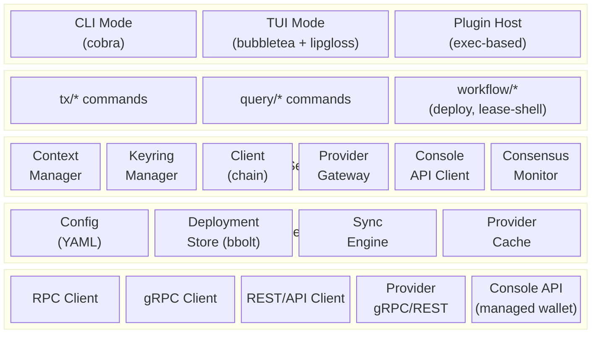
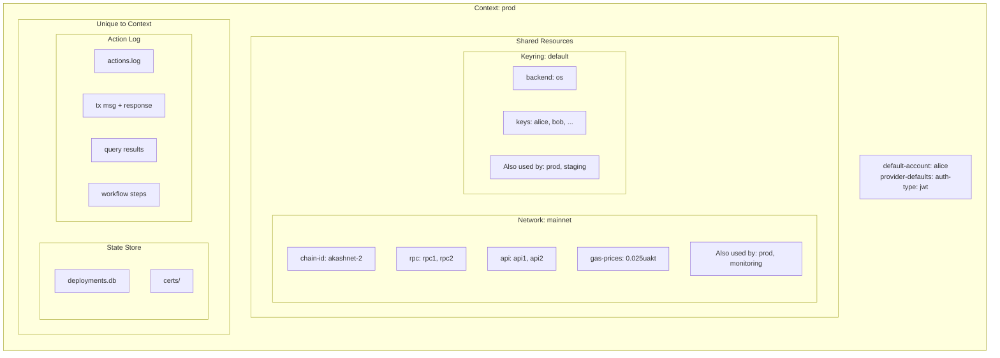
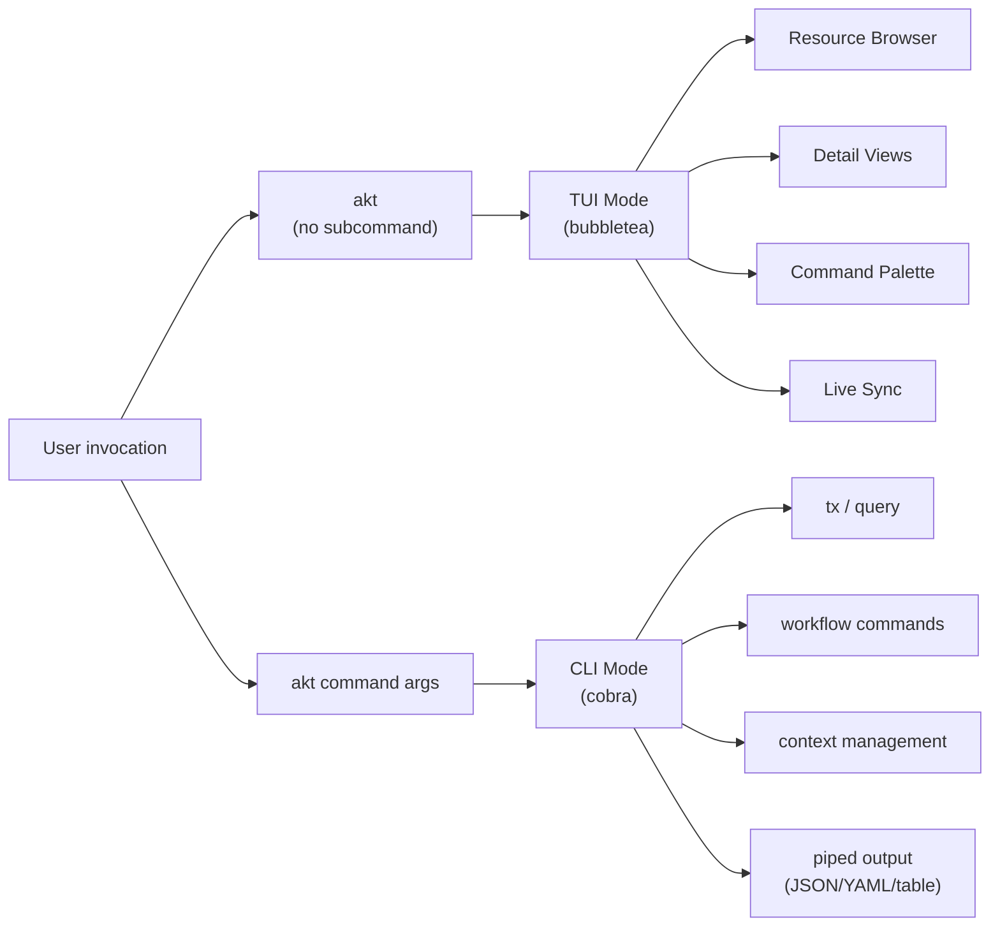
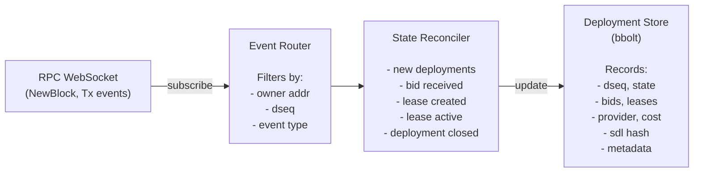

# Akash CLI (`akt`) - Architecture Design

## 1. Overview

`akt` is the unified command-line interface and terminal user interface for the Akash Network. It replaces the CLI functionality currently spread across `akash-network/node`, `akash-network/provider`, and `akash-network/chain-sdk/go/cli` with a single, cohesive tool that supports both traditional CLI commands and an interactive TUI.

### 1.1 Goals

- **Unified entry point**: One binary (`akt`) for all Akash user interactions -- deployments, leases, provider queries, certificate management, governance, staking, and more.
- **Switchable contexts**: named contexts allowing users to work across multiple networks, accounts, and environments seamlessly.
- **Dual-mode interface**: Traditional CLI for scripting and automation, plus an interactive TUI for real-time monitoring and management.
- **Real-time network monitoring**: Live consensus state visualization, validator voting status, and provider fleet health monitoring -- incorporating the functionality of [`aktop`](https://github.com/cloud-j-luna/aktop) directly into the TUI.
- **Local state tracking**: A local store that tracks deployment lifecycle, syncs with chain state, and supports backup/restore.
- **Console API integration**: Contexts can authenticate via [Akash Console](https://console.akash.network) API key, using the Console's custodial managed wallet for deployment operations without local key management.
- **Plugin extensibility**: A plugin system for community-contributed commands and integrations.
- **Flag-minimal operation**: After initial context configuration (network, keyring, default account), the majority of CLI operations require zero additional flags or environment variables. The context system supplies all defaults — users type only the command and, when needed, a resource identifier. Flags remain available as overrides but are not the primary interaction model.
- **Argument-driven filtering**: Query commands use positional arguments for resource identification instead of flag-based filters. Akash resources follow a hierarchical identity model; the filter argument accepts a `/`-separated path with smart type detection (bech32 address = owner/provider, number = dseq). An omitted leading owner defaults to the context's default account. Non-identity filters like `--state` remain as flags. For bids and leases, `--by provider` switches the filter hierarchy so the leading address is the provider (`provider/dseq/gseq/oseq/owner`) instead of the owner.

### 1.2 Non-Goals

- Running an Akash provider node (the `run` command and Kubernetes operators remain in `akash-network/provider`).
- Running a blockchain validator node (the `start` command and server infrastructure remain in `akash-network/node`).
- Genesis preparation, chain initialization, and testnet scaffolding commands.

### 1.3 Relationship to Existing Repositories

| Repository                       | Current Role                                                                                             | After `akt`                                                                                                                                                 |
|----------------------------------|----------------------------------------------------------------------------------------------------------|-------------------------------------------------------------------------------------------------------------------------------------------------------------|
| `akash-network/chain-sdk/go/cli` | All CLI command definitions (tx, query, keys, server)                                                    | **Deprecated.** Commands clean-copied into `akt`. Package removed once `akt` reaches parity.                                                                |
| `akash-network/node`             | Blockchain node binary (`akash`). Imports chain-sdk CLI, adds server/genesis/testnet commands.           | **Keeps** only node-operator commands: `start`, `comet`, `export`, `prepare-genesis`, `testnet`, `testnetify`, `auth jwt`. Stops exporting user-facing CLI. |
| `akash-network/provider`         | Provider binary (`provider-services`). Imports chain-sdk CLI, adds provider gateway + operator commands. | **Keeps** only provider-operator commands: `run`, `operator *`, `tools *`, `migrate`. Stops exporting user-facing CLI.                                      |
| `ovrclk/akt`                     | MVP CLI prototype. Config system, account/network/deploy commands.                                       | Design reference. Concepts (profiles, git-like config) evolved into the context system.                                                                     |
| `cloud-j-luna/aktop`             | Community TUI for monitoring Akash consensus state, validator voting, and provider operations.           | Design reference and prior art for TUI. Its consensus/validator/provider monitoring views inform the TUI design. Functionality subsumed by `akt monitor`. |
| **`akash-network/akt`**          | **New.** This repository.                                                                                | The unified user CLI and TUI.                                                                                                                               |

### 1.4 The `monitor` Command

`akt monitor` is a hub-based real-time monitoring tool. It is one of the most important tools in the Akash ecosystem for observing network health, provider fleet status, and BME state — especially during coordinated chain upgrades.

The hub presents three dashboards, navigable via Tab/Shift-Tab:

| Dashboard | CLI Subcommand | Content |
|-----------|---------------|---------|
| **Network** (default) | `akt monitor network` | Consensus state, validator voting, governance parameters |
| **Provider** | `akt monitor provider` | Provider fleet health, version distribution, resource utilization |
| **Oracle/BME** | `akt monitor oracle` / `akt monitor bme` | Aggregated prices, price health, vault state, mint status, ledger |

`akt monitor` with no subcommand launches the hub, defaulting to the Network dashboard. Each subcommand launches directly into its respective dashboard. `akt monitor oracle` and `akt monitor bme` are aliases that both open the Oracle/BME dashboard.

#### Goals

- **Real-time network state monitoring**: Live consensus state (height, round, step), validator voting progress (prevote/precommit power), and individual validator vote status — updated via WebSocket subscription to the RPC endpoint.
- **Provider fleet monitoring**: Real-time provider health scanning, version distribution visualization, per-provider resource utilization (CPU, memory, GPU), and node-level detail. Smart caching with priority-based scheduling (online: 1m, recently offline: 5m, long-term offline: 6h).
- **Oracle and BME state monitoring**: Live aggregated prices with TWAP, median, min/max, source count, and price health status. BME vault state (balances, total burned/minted, remint credits), mint status (healthy/warning/halt with collateral ratio and thresholds), and recent ledger entries. Combined into a single dashboard since BME depends on oracle prices.
- **Governance visibility**: Active proposals with vote tallies, and module-by-module governance parameter browsing.
- **Critical tool during network upgrades**: Validators coordinate upgrades at a specific block height; the chain halts while validators upgrade their software. Online block explorers and status pages frequently lag, stall, or lose their WebSocket connections during these windows, making them unreliable. `akt monitor` connects directly to the user's chosen RPC endpoint, providing the authoritative local view of: which round and step the chain is in, which validators have come back online and are voting, whether 2/3+ voting power has reached precommit, and when the chain resumes block production.
- **Standalone operation**: Requires only an RPC endpoint — no keyring, no default account, no chain-id. A monitoring-only context (with no `default-account`) or a bare `--rpc` flag is sufficient. This makes it usable by anyone observing the network, not just deployers.
- **Context-integrated but not context-dependent**: When a context is active, the RPC endpoint resolves automatically (consistent with the flag-minimal operation goal). A positional argument or `--rpc` flag overrides for ad-hoc monitoring of any network.
- **Hub-based navigation**: Tab/Shift-Tab cycles between three dashboards (Network, Provider, Oracle/BME); number keys (1/2/3) switch sub-tabs within the Network dashboard. Each dashboard is also directly accessible via its CLI subcommand.

#### Non-Goals

- **Deployment, lease, or user-specific resource monitoring**: `monitor` is a network-wide observation tool, not a deployment management interface.

---

## 2. High-Level Architecture



---

## 3. Core Design Concepts

### 3.1 Context System

The context system is the foundational concept of the new CLI. Every operation executes within a named context. A context is a composition of four distinct objects, some shared and some unique:



#### 3.1.1 Context Components

**Network** (shared, templatable):
- Defines chain connectivity: chain-id, RPC/API/gRPC endpoints, gas prices, gas adjustment.
- Can be shared by multiple contexts (e.g., a "mainnet" network used by both "prod" and "monitoring" contexts).
- Instantiatable from built-in templates (mainnet, testnet, sandbox).
- When a shared network's config is edited within a context, two modes are offered:
  - **Edit parent**: Modify the network definition. Change applies to all contexts using it.
  - **Fork**: Create a copy of the network for this context only. The context switches to the forked copy.

**Keyring** (shared):
- Wallet storage. Contains private keys, mnemonics, hardware wallet references.
- Can be shared between multiple contexts. Adding a key to a keyring makes it available to all contexts that reference it.
- Each context selects a default account from its keyring.
- Not used when the context's `auth-method` is `console-api`.

**State Store** (unique per context):
- Deployment, lease, and bid records (bbolt database).
- Certificate cache.
- Sync state metadata.

**Action Log** (unique per context):
- Append-only log of all user actions within the context.
- Each entry records what was done, when, and the result.
- A transaction action consists of two parts: the tx message and the chain response.
- Query actions, workflow steps, and errors are also logged.

#### 3.1.2 Context Propagation

The context is resolved once at application startup and propagated through the entire session:

1. Resolve which context to use: `--context` flag > `AKT_CONTEXT` env var > `current-context` in config.
2. Load the context's network, keyring, store, and action log.
3. Apply overrides: flags > env vars > network config > built-in defaults.
4. Inject the resolved context into all services (client, provider gateway, sync engine, TUI).

#### 3.1.3 Live Reload

The context is **live-reloadable**. The config file is watched for changes (via fsnotify or polling):

- **CLI mode**: If the config file changes mid-session (e.g., RPC endpoint updated), the change is picked up for subsequent commands in long-running operations. Flag and env overrides still take precedence.
- **TUI mode**: Config changes are detected and applied immediately to all subsequent actions, **regardless of whether flags or env vars are set**. The TUI header updates to reflect the new state. Active WebSocket connections are re-established if endpoints change.

This means a user can edit their config in another terminal and see the TUI react without restarting.

#### 3.1.4 Authentication Methods

Each context has an `auth-method` that determines how transactions are signed and submitted:

**`keyring`** (default):
- Local key management via Cosmos SDK keyrings.
- Transactions are signed locally and broadcast directly to the chain.
- All `tx` and `query` commands work.
- Requires a keyring reference and key management.

**`console-api`**:
- Custodial managed wallet via the [Akash Console API](https://console.akash.network).
- The Console backend holds the wallet keys, signs transactions, and broadcasts on the user's behalf.
- Authenticated via an API key (created at console.akash.network > Settings > API Keys).
- The API key is supplied via the `AKT_CONSOLE_API_KEY` environment variable or the `--console-api-key` flag. It is **not** persisted in config or keyring.
- Deposits are denominated in USD (not uakt) -- the Console handles the conversion.
- Only deployment lifecycle operations are supported through the Console API (create, update, close, bids, leases, deposit). Query commands still work directly against chain RPC.
- No keyring, default-account, or provider-defaults are used. The context only needs a network (for query commands) and the API key.

A context uses **one** auth method. Users who need both can create separate contexts (e.g., `prod` with keyring auth and `console` with console-api auth), potentially sharing the same network definition.

### 3.2 Dual-Mode Architecture



Both modes share the same core services (context, keyring, client, store). The TUI wraps these services in bubbletea models; the CLI wraps them in cobra command handlers.

**Smart interactivity**: Commands auto-detect whether a TTY is attached. When interactive, they show prompts, spinners, and colored output. When piped, they output machine-readable formats silently. The `--interactive` and `--yes` flags override this behavior.

**Workflow execution modes**: Workflow commands (`akt deploy`, `akt update`, `akt close`) support two output modes:
- **TUI mode** (default when TTY is attached): Interactive bubbletea UI with progress display, bid selection tables, spinners, and colored status output.
- **JSONL mode** (`--output jsonl`): Emits one JSONL line per completed step to stdout. Each line is a self-contained JSON object with workflow name, unique run ID, step name, result status, errors, and transaction results. Designed for CI/CD pipelines, scripts, and programmatic consumption.

**Glyphs**: The interface uses ASCII-safe glyphs exclusively. There is no Nerd Font mode. All glyphs are defined in a centralized registry (`internal/glyphs/`) with semantic names; rendering code references the registry, never inline string literals. Standard Unicode characters (block drawing `█░▀`, arrows `←↑→↓`, box drawing `─`, circles `●`) are used freely since they render correctly in virtually all terminal fonts.

**CLI UX principles**: The CLI follows six core UX principles that inform all command design:

1. **Familiarity** -- Standard flags (`--help`, `--version`, `--yes`, `--dry-run`, `--verbose`, `--quiet`), consistent noun-verb command patterns, and conventions matching the Cosmos SDK ecosystem.
2. **Discoverability** -- Every command includes usage examples in `--help`. Shell completion for commands, flags, and context/network names. Typo suggestions via Levenshtein distance ("Did you mean?"). Command palette in TUI with fuzzy search.
3. **Feedback** -- Progress indicators on stderr for operations exceeding 1 second (gas simulation, broadcast, confirmation wait). Confirmations for success. Live state display in TUI header.
4. **Clarity** -- Structured output with sections, aligned columns, indentation hierarchy, and semantic color coding. Data on stdout, everything else on stderr.
5. **Flow** -- Dual-mode operation (interactive + scripted), correct exit codes, `--quiet` for pipeline-friendly output, `--output json|yaml|jsonl` for machine consumption.
6. **Forgiveness** -- Three-part error messages (what happened, context, suggestion), confirmation dialogs for destructive actions, typo correction, and clear `--force` vs `--yes` semantics.

See [SPEC.md sections 3, 10, and 11](SPEC.md) for the detailed specification of these principles.

### 3.3 Storage Architecture

```
~/.config/akt/                          # XDG_CONFIG_HOME/akt
├── config.yaml                         # Global config (contexts, networks, keyrings, settings)
├── keyrings/                           # Keyring backends (shared across contexts)
│   ├── default/                        # Default keyring (OS keyring backend)
│   └── hardware/                       # Example: Ledger-backed keyring
├── contexts/                           # Per-context data
│   ├── prod/
│   │   ├── store/
│   │   │   ├── deployments.db          # bbolt database (unique to context)
│   │   │   └── certs/                  # Local certificate cache
│   │   └── actions.log                 # Action log (unique to context)
│   ├── staging/
│   │   ├── store/
│   │   │   ├── deployments.db
│   │   │   └── certs/
│   │   └── actions.log
│   └── monitoring/
│       ├── store/
│       │   ├── deployments.db
│       │   └── certs/
│       └── actions.log
├── cache/                              # Shared caches
│   ├── providers.json                  # Provider fleet cache
│   └── monikers.json                   # Validator moniker cache
└── plugins/                            # Locally installed plugins
    └── akt-sdl-lint                    # Example plugin binary
```

The config root is always `$XDG_CONFIG_HOME/akt` (typically `~/.config/akt`). The active context is selected via `AKT_CONTEXT` env var or `--context` flag.

Key distinction: `keyrings/` and `networks` (in config.yaml) are **shared** resources referenced by name. `contexts/` directories contain data **unique** to each context (state store and action log).

### 3.4 Sync Engine

The sync engine runs as a background goroutine during active CLI/TUI sessions. It keeps the local deployment store in sync with on-chain state.



**Startup behavior**: On first launch for a context, the sync engine performs a full reconciliation by querying all deployments owned by accounts in the context. Subsequent launches use incremental sync from the last known block height.

**Reconnection**: On WebSocket disconnect, the engine uses exponential backoff (1s, 2s, 4s, ... up to 60s) with jitter. Missed blocks are reconciled by querying the range between last-synced height and current height.

---

## 4. Package Structure

```
github.com/akash-network/akt/
├── cmd/
│   └── akt/                             # Binary entry point
├── internal/
│   ├── cli/                             # CLI mode (cobra commands)
│   │   ├── chain/                       # Clean-copied chain-sdk go/cli (tx/query)
│   │   ├── tx/                          # Transaction commands (per-module)
│   │   ├── query/                       # Query commands (per-module)
│   │   ├── workflow/                    # Workflow CLI wrappers (deploy, update, close)
│   │   ├── context/                     # Context management commands
│   │   ├── keys/                        # Key management commands
│   │   ├── provider/                    # Provider gateway commands
│   │   ├── store/                       # Store management commands
│   │   └── plugin/                      # Plugin management
│   ├── tui/                             # TUI mode (bubbletea)
│   │   ├── views/                       # TUI view models (one per resource type)
│   │   ├── components/                  # Reusable TUI components
│   │   └── messages/                    # Custom bubbletea messages
│   ├── context/                         # Context management core
│   ├── actionlog/                       # Action log (unique per context)
│   ├── workflow/                        # Declarative workflow engine
│   │   ├── steps/                       # Step type implementations
│   │   └── builtin/                     # Embedded default workflow definitions
│   ├── codec/                           # Application-wide encoding config
│   ├── keyring/                         # Keyring abstraction
│   ├── client/                          # Chain client
│   │   └── modules/                     # Module-specific helpers
│   ├── provider/                        # Provider gateway client
│   ├── console/                         # Console API client (managed wallet)
│   ├── store/                           # Local deployment store
│   │   └── bbolt/                       # bbolt backend implementation
│   ├── sync/                            # Chain sync engine
│   ├── events/                          # Shared blockchain event service (pubsub bus)
│   ├── monitor/                          # Real-time monitoring (akt monitor)
│   │   ├── ui/                          # Bubbletea model, views, styles
│   │   ├── consensus/                   # Consensus state types and parsers
│   │   ├── governance/                  # Governance parameter types
│   │   ├── rpc/                         # RPC/WebSocket/gRPC clients
│   │   └── cache/                       # Persistent cache (bbolt)
│   ├── mcp/                             # MCP server (akt mcp)
│   │   ├── marshal/                     # Parameter extraction and result helpers
│   │   └── tools/                       # MCP tool definitions and handlers
│   │       ├── node/                    # Node status, block height
│   │       ├── bank/                    # Account balances
│   │       ├── deployment/              # Deployment queries and close tx
│   │       ├── market/                  # Orders, bids, leases queries and txs
│   │       ├── provider/                # Provider queries and REST tools
│   │       ├── audit/                   # Audited provider queries
│   │       └── cert/                    # Certificate queries
│   ├── plugin/                          # Plugin system
│   ├── filter/                          # Resource filter argument parsing (§3.8)
│   ├── flags/                           # Shared flag definitions
│   └── output/                          # Output formatting
│       └── pretty/                      # Pretty output for query results (registry-based)
├── pkg/                                 # Public API (for plugins)
│   └── types/                           # Shared types for plugin protocol
└── e2e/                                 # End-to-end tests
```

---

## 5. Key Design Decisions

### 5.1 Clean Copy from chain-sdk

Commands are copied from `akash-network/chain-sdk/go/cli` with the following cleanups:

- **Remove dead code**: Unused utilities, stub files (`escrow.go` is empty), and unfinished features.
- **Standardize patterns**: Every command follows the same RunE handler pattern -- resolve context, get client, build message, execute, format output.
- **Adapt to context system**: Replace direct flag reading (e.g., `--node`, `--chain-id`) with context-aware resolution that falls back through the override chain.
- **Preserve behavior**: All tx/query operations produce the same on-chain results. Flag names remain the same where feasible.

The `chain-sdk` CLI package (`pkg.akt.dev/go/cli`) will be deprecated and eventually removed once `akt` reaches full feature parity. In the interim, the `go/cli` code is clean-copied into `internal/cli/chain` and adjusted to respect akt context defaults; all other chain-sdk packages are imported directly.

### 5.2 Cobra for CLI, Bubbletea for TUI

- **Cobra** handles command parsing, flag management, help generation, and shell completion for CLI mode. It is the standard in the Go and Cosmos SDK ecosystem.
- **Bubbletea v2** (Elm Architecture: Model-Update-View) handles the interactive TUI. Its functional design isolates state management and rendering.
- **Lipgloss v2** provides CSS-like styling for terminal output in both modes -- table formatting in CLI, full layout composition in TUI.
- **Bubbles v2** provides battle-tested components: table, viewport, text input, spinner, help, key bindings, list, progress bar, paginator.

**Bubbles v2 component usage by UI element:**

| UI Element | Bubbles Component | Location |
|---|---|---|
| Provider list, validator list, block history, node list | `table` | `internal/monitor/ui/` |
| Scan progress bar, prevote/precommit vote progress bars | `progress` | `internal/monitor/ui/` |
| Governance module selector, command palette command list | `list` | `internal/monitor/ui/`, `internal/tui/views/` |
| Governance parameter display, scrollable detail panes | `viewport` | `internal/monitor/ui/` |
| Command palette search input | `textinput` | `internal/tui/views/` |
| Keybinding definitions and matching | `key` | `internal/tui/`, `internal/monitor/ui/` |
| Status bar keybinding help | `help` | `internal/tui/` |
| Loading indicators (provider scan, data fetch) | `spinner` | `internal/monitor/ui/` |

Custom visualizations without bubbles equivalents remain hand-rolled:
- Vote grid (`FormatVoteGrid()`) — colored ●/○ bit array
- Signing history bar (`renderSigningBar()`) — per-validator colored dot sequence
- Version distribution dot chart — ●/○ dot visualization per provider version

### 5.3 Store Interface for Multiple Backends

The deployment store is defined as a Go interface, with bbolt as the default backend. This allows:

- **Testing**: In-memory backends for unit tests.
- **Future backends**: SQLite, remote/networked stores, or other embedded databases.
- **Import/Export**: Backends implement serialization to YAML/JSON for backup, restore, and machine portability.

The store is sync-ready: every record has a `version` field (monotonically increasing) and `updated_at` timestamp. The sync engine updates records through the same interface, enabling future remote sync without changing the data model.

### 5.4 Plugin System (exec-based)

Following kubectl's proven plugin model:

- Plugins are executables named `akt-<name>` found in `$PATH` or `~/.config/akt/plugins/`.
- `akt <name> [args]` delegates to the plugin binary if no built-in command matches.
- Plugins receive context information via environment variables (`AKT_CONTEXT`, `AKT_CHAIN_ID`, `AKT_NODE`, `AKT_FROM`, `AKT_OUTPUT`, etc.).
- An optional plugin manifest (`plugin.yaml` next to the binary) declares metadata, required context fields, and help text.
- Built-in management: `akt plugin install <url>`, `akt plugin list`, `akt plugin remove <name>`.

### 5.5 Pretty Output (Registry-Based Formatters)

Query commands use a registry-based formatter system (`internal/output/pretty/`) to render human-friendly output. Each protobuf response type can have a registered `PrettyFormatter` that controls how it is displayed.

**Output behavior matrix:**

| `--output` (`-o`) | Behavior |
|-------------------|----------|
| `pretty` (default) | Pretty tables with lipgloss colors, state coding, sections |
| `json` | Machine-readable JSON (compact, no colors) |
| `yaml` | Machine-readable YAML (no colors) |

**Dispatch flow:** Every query command calls `pretty.PrintQueryResult(cmd, cctx, msg)`. This function reads `--output`: if `json` or `yaml`, it delegates to `clientCtx.PrintProto()` with the appropriate Cosmos SDK output format; if `pretty` (the default), it looks up a registered `PrettyFormatter` for the message's protobuf type. If a formatter exists, it renders pretty output; otherwise, it falls back to JSON output. This means new protobuf types automatically get JSON output until a formatter is registered -- no regressions.

**Formatting conventions:**
- **List results**: Tabwriter-aligned tables with lipgloss-styled headers. State columns are color-coded (green=active/open, yellow=warning states, red=closed/lost, gray=invalid). Key identifiers (DSEQ, moniker) are bolded.
- **Single-item results**: Grouped key-value pairs with lipgloss-styled section headers (e.g., "Deployment", "Groups", "Escrow"). Values are colorized where appropriate.
- **Addresses**: Always displayed in full. Never truncated or shortened by default -- addresses are machine-parseable identifiers and truncation risks ambiguity. Users who need shorter output can pipe through `cut` or `jq`.
- **Amounts and prices**: All micro-denominated values (`u`-prefixed denoms: uakt, uatom, uosmo, etc.) are scaled to the most readable unit. Thresholds: >= 1,000,000 micro → base denom (e.g., `5.3 AKT`); >= 1,000 micro → milli denom (e.g., `3 mAKT`); < 1,000 micro → micro denom (e.g., `500 uAKT`). Trailing zeros are always stripped. This applies uniformly to every pretty output: balances, prices, escrow amounts, staking tokens, rewards, fees, and any other monetary value. Non-micro denoms and IBC denoms are shown as-is.

### 5.6 Multi-Endpoint Failover

Each context can define multiple endpoints per transport type (RPC, API, gRPC). The client layer implements automatic failover:

1. Try the first endpoint in the list.
2. On connection failure or timeout (configurable, default 5s), try the next.
3. On successful connection, promote that endpoint to the top of the list for subsequent requests within the session.
4. Health checks run periodically (every 30s) to detect degraded endpoints proactively.

**Transport-specific behavior:**

- **RPC**: HTTP GET to `{endpoint}/health` (CometBFT health endpoint). Healthy = HTTP 200.
- **API (REST)**: HTTP GET to `{endpoint}/cosmos/base/tendermint/v1beta1/node_info`. Healthy = HTTP 200 with valid JSON.
- **gRPC**: gRPC health check protocol (`grpc.health.v1.Health/Check`). Healthy = `SERVING` status. Falls back to a lightweight unary RPC (e.g., `GetNodeInfo`) if the health service is not registered.

Health check interval defaults to 30s and is not user-configurable in Phase 1. Failover state (endpoint ordering) is session-scoped and does not persist across sessions. All three transport types follow the same failover algorithm described above.

This replaces the MVP's manual backup-endpoint approach with transparent, automatic resilience.

### 5.7 Transaction Result Pretty Output

Transaction commands (`tx`) use the same registry-based formatter system as query commands (§5.5) to render human-friendly transaction results. When `--output pretty` is active (the default for both `tx` and `query` commands), a `TxResponse` is rendered in two distinct sections.

**Section 1: Transaction Summary (common to all transactions)**

Every transaction result renders the same header block with chain-level metadata: hash, signer, block height, gas consumption, fee paid, and success/failure status. This gives the user immediate confirmation that their transaction landed and what it cost, regardless of what the transaction did.

**Section 2: Message Detail (type-specific)**

Below the common summary, each message in the transaction is rendered using a registered `TxPrettyFormatter` for that message's protobuf type. The formatter receives the decoded `sdk.Msg` and the `TxResponse` events, allowing it to display both the message's input parameters (e.g., recipient address, amount) and any chain-emitted outputs (e.g., the DSEQ assigned to a newly created deployment).

For single-message transactions (the common case), the message detail section renders directly below the summary. For multi-message transactions, each message gets a numbered sub-section. If no formatter is registered for a message type, the message body falls back to syntax-highlighted JSON -- no regressions.

**Examples:**

Single-message transaction (deployment create):

```
Transaction
  Hash:       ABCDEF1234567890ABCDEF1234567890ABCDEF1234567890ABCDEF1234567890
  Signer:     akash1abcdefghijklmnopqrstuvwxyz012345678901
  Height:     18,234,567
  Gas Used:   150,000 / 200,000
  Fee:        3.75 mAKT
  Status:     success

Deployment Created
  Owner:      akash1abcdefghijklmnopqrstuvwxyz012345678901
  DSEQ:       12345
  Deposit:    5 AKT
```

Multi-message transaction (withdraw rewards + delegate):

```
Transaction
  Hash:       ABCDEF1234567890ABCDEF1234567890ABCDEF1234567890ABCDEF1234567890
  Signer:     akash1abcdefghijklmnopqrstuvwxyz012345678901
  Height:     18,234,570
  Gas Used:   250,000 / 300,000
  Fee:        7.5 mAKT
  Status:     success

Message 1: Withdraw Rewards
  Delegator:  akash1abcdefghijklmnopqrstuvwxyz012345678901
  Validator:  akashvaloper1abcdefghijklmnopqrstuvwxyz012345

Message 2: Delegate
  Delegator:  akash1abcdefghijklmnopqrstuvwxyz012345678901
  Validator:  akashvaloper1abcdefghijklmnopqrstuvwxyz012345
  Amount:     100 AKT
```

Failed transaction:

```
Transaction
  Hash:       ABCDEF1234567890ABCDEF1234567890ABCDEF1234567890ABCDEF1234567890
  Signer:     akash1abcdefghijklmnopqrstuvwxyz012345678901
  Height:     18,234,600
  Gas Used:   100,000 / 150,000
  Fee:        2.5 mAKT
  Status:     failed: insufficient funds: 1000uakt is smaller than 5000000uakt

Send
  From:       akash1abcdefghijklmnopqrstuvwxyz012345678901
  To:         akash1zyxwvutsrqponmlkjihgfedcba987654321098
  Amount:     5 AKT
```

---

## 6. Implementation Phases

### Phase 1: Foundation (Context + Core CLI)

**Goal**: A functional CLI that can replace basic `akash tx` and `akash query` operations.

- Network management: shared network definitions, CRUD, built-in templates
- Context system: context CRUD, composition (network + keyring + store + action log), switching, resolution chain, fork/edit-parent for networks
- Config live-reload: fsnotify watcher, context propagation on config change
- Keyring management: shared keyrings, keys visible to all referencing contexts
- Action log: append-only JSONL log per context, reading/filtering
- Chain client with multi-endpoint failover
- Core tx commands: bank, deployment, market, provider, cert, audit, staking, distribution, gov, authz, feegrant, escrow, wasm, oracle, bme, slashing, vesting, upgrade, crisis, IBC
- Core query commands: all matching modules
- Key management commands
- Output formatting with pretty output: registry-based per-type formatters for all query results, lipgloss color-coded states. `--output json` and `--output yaml` for machine-readable output
- Global flags and environment variable support
- Built-in network templates (mainnet, testnet, sandbox)
- Version command with build-time injection
- Shell completion (bash, zsh, fish)
- Basic e2e test suite

### Phase 2: Store + Workflow Commands

**Goal**: Local state tracking and high-level workflow commands that orchestrate multi-step operations.

- bbolt-based deployment store with full interface implementation
- Store schema versioning and migration framework
- Sync engine: WebSocket subscription, event routing, state reconciliation
- `akt deploy` workflow command: create deployment, wait for bids, select bid (interactive or auto), create lease, send manifest, wait for active, display endpoint URLs. Workflows support **two execution modes**: TUI mode (interactive, user-friendly progress display) and JSONL mode (`--output jsonl`, JSONL output for automation and scripting).
- Provider gateway client: status, lease-status, lease-logs, lease-events, lease-shell, send-manifest, get-manifest
- Provider migration commands: migrate-hostnames, migrate-endpoints
- Store export/import commands
- Store status command (sync state, record counts)
- Console API client: `auth-method: console-api` context support, API key via `AKT_CONSOLE_API_KEY` env var, deployment operations via Console managed wallet API (`https://console-api.akash.network`)

### Phase 3: TUI Mode

**Goal**: A fully interactive terminal UI for real-time Akash management, incorporating the monitoring functionality of [`aktop`](https://github.com/cloud-j-luna/aktop) via the `akt monitor` command.

- Bubbletea application shell: header, main area, status bar
- Navigation system: resource type selector, breadcrumb trail, back/forward
- Resource views: deployments, leases, bids, orders, providers, certificates
- Detail panes: YAML/JSON toggle, scrollable viewport
- **`akt monitor` hub**: Hub-based real-time monitoring with three dashboards (Network, Provider, Oracle/BME), navigable via Tab/Shift-Tab. Each dashboard also launchable directly via `akt monitor network`, `akt monitor provider`, `akt monitor oracle` / `akt monitor bme`.
- **Network dashboard** (from aktop): Consensus state (height, round, step), prevote/precommit progress bars with voting power percentages, validator vote grid (`●`/`○`), scrollable validator list with moniker resolution and block signing history bar, module-by-module governance parameter browsing. Sub-tabs: Overview (1), Validators (2), Governance (3).
  - Validator view requirements:
    1. Display list of validators with index, moniker, voting power (absolute + percentage), and block progress bar
    2. Blocks are horizontal progress bars growing left to right, newest block on the left
    3. Blocks must be horizontally spaced so the user can distinguish individual blocks
    4. Blocks must be vertically spaced so the user can distinguish lines between validators
    5. Block progress bar must be vertically centred with the text to its left (validator name, power)
    6. Three block colors: **green** = validator vote captured, **red** = validator vote missed, **yellow star** = block proposer
    7. j/k cursor selection with Enter to expand validator detail panel (full address, pubkey, power, signing stats)
    8. Proposer indicator shown as star overlay on the block in the signing bar (not a separate column)
- **Provider dashboard**: Provider version distribution with dot visualization, provider health scanning with priority-based scheduling, per-provider detail with node-level CPU/memory/GPU resources, smart caching with configurable check intervals
- **Oracle/BME dashboard**: Oracle aggregated prices (TWAP, median, min/max, sources, health) and BME vault state (balances, burned/minted, remint credits), mint status (healthy/warning/halt with collateral ratio), recent ledger entries. Combined since BME depends on oracle prices.
- Real-time log streaming view
- Command palette with fuzzy search
- Transaction confirmation dialogs
- Live sync integration (store changes reflected in TUI immediately)
- Provider cache with smart scheduling (online: 1m, recently offline: 5m, long-term offline: 6h)
- Configurable keybindings (vim-style defaults)
- Theme system (light/dark, customizable colors)

### Phase 4: Extended Features

**Goal**: Complete feature set, polish, and extensibility.

- Plugin system: discovery, execution, manifest parsing, management commands
- Full resource set in TUI: governance proposals (with voting), validators (with delegation), escrow accounts, wasm contracts, oracle prices, IBC channels
- Additional TUI actions: create deployment from TUI, close deployment, fund escrow, vote on proposals
- Performance optimization: lazy loading, virtual scrolling for large lists
- Comprehensive e2e test suite covering all commands and TUI interactions
- Documentation and user guide

---

## 7. Migration Strategy

### 7.1 Command Mapping from `akash`

| Current (`akash`)             | New (`akt`)                 | Notes                              |
| ----------------------------- | --------------------------- | ---------------------------------- |
| `akash tx bank send`          | `akt tx bank send`          | Identical behavior                 |
| `akash tx deployment create`  | `akt tx deployment create`  | Identical behavior                 |
| `akash tx deployment close`   | `akt tx deployment close`   | Identical behavior                 |
| `akash tx deployment update`  | `akt tx deployment update`  | Identical behavior                 |
| `akash tx deployment group *` | `akt tx deployment group *` | Identical behavior                 |
| `akash tx market bid *`       | `akt tx market bid *`       | Identical behavior                 |
| `akash tx market lease *`     | `akt tx market lease *`     | Identical behavior                 |
| `akash tx provider *`         | `akt tx provider *`         | Identical behavior                 |
| `akash tx cert *`             | `akt tx cert *`             | Identical behavior                 |
| `akash tx audit *`            | `akt tx audit *`            | Identical behavior                 |
| `akash tx staking *`          | `akt tx staking *`          | Identical behavior                 |
| `akash tx distribution *`     | `akt tx distribution *`     | Identical behavior                 |
| `akash tx gov *`              | `akt tx gov *`              | Identical behavior                 |
| `akash tx wasm *`             | `akt tx wasm *`             | Identical behavior                 |
| `akash tx oracle *`           | `akt tx oracle *`           | Identical behavior                 |
| `akash tx bme *`              | `akt tx bme *`              | Identical behavior                 |
| `akash query *`               | `akt query *`               | Cosmos SDK modules: identical. Akash modules: simplified (see below). |

**Akash query command simplifications** (non-breaking -- same backend queries, different CLI surface):

| Current (`akash`)                       | New (`akt`)                                  | Notes                              |
| --------------------------------------- | -------------------------------------------- | ---------------------------------- |
| `akash query deployment deployments`    | `akt query deployment [filter]`              | Filter: `[owner/]dseq`; no arg → list for default account |
| `akash query deployment group get`      | `akt query deployment group [filter]`        | Filter: `[owner/]dseq[/gseq]`                             |
| `akash query market orders`             | `akt query market order [filter]`            | Filter: `[owner/]dseq[/gseq/oseq]`                        |
| `akash query market bids`               | `akt query market bid [filter]`              | Filter: `[owner/]dseq[/…/provider]`; `--by provider` reverses hierarchy |
| `akash query market leases`             | `akt query market lease [filter]`            | Filter: `[owner/]dseq[/…/provider]`; `--by provider` reverses hierarchy |
| `akash query provider list`/`get`       | `akt query provider [address]`               | Optional positional arg (unchanged)                        |
| `akash query cert list`                 | `akt query cert [owner]`                     | Filter by owner; no arg → default account                  |
| `akash query audit list`/`get`          | `akt query audit [owner]`                    | Filter by owner; no arg → list all                         |
| `akash query escrow accounts`           | `akt query escrow [filter]`                  | Filter: `[owner[/dseq]]`                                   |
| `akash query escrow payments`           | `akt query escrow payment [filter]`          | Filter: `[owner[/dseq]]`                                   |
| `akash keys *`                | `akt context keys *`        | Identical behavior; moved under context |
| (none)                        | `akt context *`             | New context management             |
| (none)                        | `akt deploy <sdl-file>`     | New workflow command               |
| (none)                        | `akt update <sdl-file> [dseq]` | New workflow command            |
| (none)                        | `akt close [dseq]`          | New workflow command               |
| (none)                        | `akt` (no subcommand)       | Launches TUI mode by default       |
| (none)                        | `akt store *`               | New store management               |
| (none)                        | `akt plugin *`              | New plugin management              |

### 7.2 Command Mapping from `provider-services`

| Current (`provider-services`)         | New (`akt`)                      | Notes              |
| ------------------------------------- | -------------------------------- | ------------------ |
| `provider-services status`            | `akt provider status`            | Identical behavior |
| `provider-services lease-status`      | `akt provider lease-status`      | Identical behavior |
| `provider-services lease-logs`        | `akt provider lease-logs`        | Identical behavior |
| `provider-services lease-events`      | `akt provider lease-events`      | Identical behavior |
| `provider-services lease-shell`       | `akt provider lease-shell`       | Identical behavior |
| `provider-services send-manifest`     | `akt provider send-manifest`     | Identical behavior |
| `provider-services get-manifest`      | `akt provider get-manifest`      | Identical behavior |
| `provider-services migrate-hostnames` | `akt provider migrate-hostnames` | Identical behavior |
| `provider-services migrate-endpoints` | `akt provider migrate-endpoints` | Identical behavior |


### 7.3 Commands NOT Migrated

These remain in their respective repositories:

**Stays in `akash-network/node`:**
- `akash start` -- blockchain node server
- `akash comet *` -- CometBFT management (show-node-id, show-validator, etc.)
- `akash export` -- state export
- `akash prepare-genesis` -- genesis preparation with Akash-specific parameters
- `akash testnet` -- testnet scaffolding
- `akash testnetify` -- mainnet-to-testnet conversion
- `akash auth jwt` -- JWT token generation for provider auth
- `akash init` -- genesis initialization
- `akash gentx`, `akash collect-gentxs`, `akash add-genesis-account`, `akash validate-genesis`
- All server-related commands (pruning, snapshot, status, rollback, module-hash)

**Stays in `akash-network/provider`:**
- `provider-services run` -- launches the full provider service
- `provider-services operator hostname` -- hostname/ingress operator
- `provider-services operator ip` -- IP/MetalLB operator
- `provider-services operator inventory` -- inventory operator
- `provider-services tools psutil *` -- hardware discovery tools
- `provider-services migrate run` -- migration runner
- `provider-services migrate-*` -- all migration commands
- `provider-services sdl-to-manifest` -- SDL conversion utility (provider-internal)
- `provider-services show-cluster-ns` -- Kubernetes namespace utility
